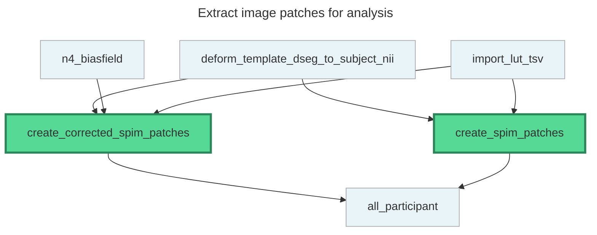

# DAG Diagrams Summary

This document provides a quick overview of the DAG diagram implementation for SPIMquant.

## What Was Created

### 1. Mermaid Diagrams (12 files)
- 1 full rulegraph with all 40 workflow rules
- 11 modular stage-specific diagrams

### 2. Rendered Images (24 files)
- 12 SVG files (web-friendly, scalable)
- 12 PNG files (presentation-ready)

### 3. Python Scripts (2 files)
- `generate_dag_diagrams.py` - Generates Mermaid diagrams from workflow
- `render_diagrams.py` - Renders Mermaid files to SVG/PNG

### 4. Documentation (3 files)
- `docs/figures/README.md` - Guide to using the diagrams
- `docs/scripts/README.md` - Script documentation
- `docs/workflow_visualization.md` - User-facing workflow visualization page

## Workflow Stages

The workflow is organized into 11 functional stages:

1. **Import** (6 rules) - Templates, masks, atlases
2. **Preprocessing** (2 rules) - Downsampling, format conversion
3. **Masking** (5 rules) - Brain extraction
4. **Correction** (3 rules) - Intensity normalization
5. **Registration** (4 rules) - Affine and deformable alignment
6. **Transform** (3 rules) - Apply spatial transformations
7. **Segmentation** (4 rules) - Pathology detection
8. **Quantification** (5 rules) - Region properties
9. **Statistics** (4 rules) - Atlas-based analysis
10. **QC** (1 rule) - Quality reports
11. **Patches** (2 rules) - Image patch extraction

Total: **40 rules** with **86 dependencies**

## Example Diagram

Here's the patches stage diagram (smallest example):



**Legend:**
- 🟢 **Bold green nodes** = Stage-specific rules
- 🔵 **Light blue nodes** = Dependencies from other stages

## Quick Start

### View Diagrams
1. Browse rendered images in `docs/figures/`
2. View in GitHub (native Mermaid support)
3. Open SVG files in any browser
4. Use PNG files in presentations

### Regenerate Diagrams
```bash
# Generate new diagrams
python3 docs/scripts/generate_dag_diagrams.py

# Render to images
python3 docs/scripts/render_diagrams.py --format both
```

### Customize
- Edit `WORKFLOW_STAGES` in `generate_dag_diagrams.py` to modify stage definitions
- Use `--theme` flag in `render_diagrams.py` to change visual style
- Use `--template` flag to generate diagrams for different registration templates

## Benefits

1. **Understanding**: Complex workflow broken into manageable pieces
2. **Maintenance**: Automated regeneration ensures diagrams stay current
3. **Documentation**: Multiple formats for different use cases
4. **CI-Ready**: Scripts work in automated environments
5. **Accessibility**: Both source and rendered files committed

## File Sizes

```
Total diagrams:  12 Mermaid files (~40 KB)
Total SVG:       12 files (~500 KB)
Total PNG:       12 files (~250 KB)
Scripts:         2 Python files (~17 KB)
Documentation:   3 Markdown files (~15 KB)
Total:           ~820 KB
```

## Integration

The workflow visualization page has been added to the documentation index at `docs/index.md` and is accessible through the documentation website.

## Testing

All scripts have been tested and verified:
- ✅ Diagram generation from `tests/bids_ds` dataset
- ✅ Mermaid syntax validation
- ✅ SVG rendering with puppeteer
- ✅ PNG rendering with puppeteer
- ✅ Help documentation
- ✅ CI environment compatibility (no-sandbox mode)
- ✅ Security scan (0 vulnerabilities found)

## Next Steps

Users can now:
1. View workflow structure before running SPIMquant
2. Understand dependencies between processing stages
3. Regenerate diagrams as workflow evolves
4. Use diagrams in papers, presentations, and documentation
5. Integrate diagram generation into CI/CD pipelines
