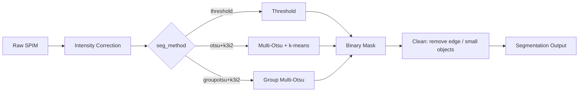

# Segmentation Methods

SPIMquant provides two built-in segmentation methods for detecting pathology signals in SPIM data, plus support for intensity correction pre-processing.  The method and correction are configured independently per stain via the `snakebids.yml` config file.

## Overview



After segmentation the binary mask is used to compute [field fraction](../reference/outputs.md#field-fraction-map-seg), [object count](../reference/outputs.md#object-count-map-seg), and [per-object region properties](../reference/outputs.md#region-properties-statistics-table-tabular).

---

## Intensity Correction

Bias-field correction is applied before segmentation to compensate for the spatially varying illumination typical of lightsheet microscopy.

### Gaussian (`correction_method: gaussian`)

A Gaussian blur is applied to the raw image at a coarse downsampled level to estimate the low-frequency illumination profile, which is then divided out.  This is fast and requires no extra memory, making it suitable for quick iteration or large datasets.

**Config key:** `correction_method: gaussian`

### N4 (`correction_method: n4`)

ANTs N4BiasFieldCorrection is applied.  N4 fits a smooth B-spline model of the bias field and is more accurate than Gaussian correction, especially for thicker sections or strong illumination gradients.

**Config key:** `correction_method: n4`

!!! tip
    Use `n4` when high quantitative accuracy is required.  Use `gaussian` for faster exploratory runs or when the illumination gradient is mild.

---

## Segmentation Methods

### Threshold (`seg_method: threshold`)

A fixed intensity threshold is applied to the (corrected) image.  Voxels above the threshold are classified as positive; all others are negative.

The threshold value is configured per-stain:

```yaml
stain_defaults:
  abeta:
    seg_method: threshold
    seg_threshold: 500   # intensity value; adjust to your data
```

**When to use:** Works well when the pathology signal is clearly brighter than background and the intensity scale is stable across subjects.  Simple to interpret and debug.

**Limitations:** Sensitive to residual intensity non-uniformities and to between-subject intensity variation.  May require manual threshold tuning per dataset.

### Multi-Otsu (`seg_method: otsu+k3i2`)

An unsupervised thresholding method that adapts to the intensity distribution of each image.

The method string encodes two parameters: `k` — the number of Otsu classes, and `i` — the threshold index to use for the binary classification.  For `otsu+k3i2`:

1. **Multi-Otsu thresholding** — Otsu's method is extended to find `k-1` thresholds that minimise within-class variance, splitting the histogram into `k` classes.  With `k=3` the image is divided into background, low-signal, and high-signal classes (2 thresholds).
2. **Binary classification** — the threshold at index `i` (1-based) is applied to produce the final binary mask.  With `i=2` this selects the second (higher) threshold, classifying only the brightest voxels as positive.

**Config key:**

```yaml
stain_defaults:
  abeta:
    seg_method: otsu+k3i2
```

**When to use:** Preferred when the staining intensity varies across subjects or imaging sessions, because the threshold adapts automatically to each image.  Also more robust to residual illumination gradients.

**Limitations:** Can fail on images with unusual histograms (e.g. very sparse pathology that does not form a distinct peak) or when the background is very noisy.

### Group Multi-Otsu (`seg_method: groupotsu+k3i2`)

A variant of Multi-Otsu that derives a **single shared threshold from the aggregate histogram of all subjects** rather than computing a threshold independently per image.  This is preferred when subjects were acquired with common acquisition settings and you want to ensure consistent, comparable quantification across the cohort.

The workflow is a two-step process:

**Step 1 — compute group threshold** (run once for the whole cohort):

```bash
spimquant /bids /output participant \
    --targets all_group_otsu \
    --seg_method groupotsu+k3i2
```

This triggers:

1. For each subject: compute a percentile-clipped intensity histogram from the bias-field corrected image and save it as an NPZ file.
2. Aggregate all subject histograms onto a common intensity grid, apply multi-level Otsu thresholding, and save the resulting thresholds as a JSON file in `{output}/group/`.

**Step 2 — segment each subject using the group threshold**:

```bash
spimquant /bids /output participant \
    --seg_method groupotsu+k3i2
```

Each subject's binary mask is produced by applying the group-level threshold from the JSON file.  A per-subject PNG is also generated showing the group threshold overlaid on the individual histogram, useful for visual quality control.

**Config key:**

```yaml
seg_method:
  - groupotsu+k3i2
```

**When to use:** Preferred when a batch of subjects shares the same acquisition protocol and you want consistent thresholding across subjects.  Reduces subject-to-subject variability in the segmentation boundary that can occur with per-subject Otsu.

**Limitations:** Less adaptive than per-subject Otsu — if staining intensity varies substantially across subjects (e.g. due to different batches of antibody or tissue preparation), a single group threshold may over- or under-segment some subjects.

---

## Post-Segmentation Cleaning

After the initial binary mask is produced, a cleaning step removes two classes of artefact:

1. **Edge objects** — connected components that touch the border of the field of view are removed, as these are typically cut-off tissue or slide artefacts rather than true pathology.
2. **Small objects** — objects below a minimum volume threshold (configured via `regionprop_filters`) are discarded, eliminating small noise specks.

!!! note "Scale convention"
    The output mask is stored on a **0–100 scale** (not 0–1).  This is deliberate: when the mask is spatially downsampled to compute field fraction, the resulting values are directly interpretable as a percentage (0–100 %).

---

## Per-Stain Configuration

Each stain is configured independently.  A typical `snakebids.yml` block looks like:

```yaml
stain_defaults:
  abeta:
    seg_method: otsu+k3i2
    correction_method: n4
    regionprop_filters:
      min_area: 50       # voxels; objects smaller than this are discarded
  Iba1:
    seg_method: threshold
    seg_threshold: 300
    correction_method: gaussian
```

Stains not listed in `stain_defaults` fall back to the top-level `seg_method` and `correction_method` keys.

---

## Further Reading

- [Output Files Reference](../reference/outputs.md) — description of segmentation output files
- [How SPIMquant Works Under the Hood](../workflow_overview.md#stage-7--segmentation) — pipeline context for segmentation
- [Imaris Crops](imaris_crops.md) — export patches for visual inspection