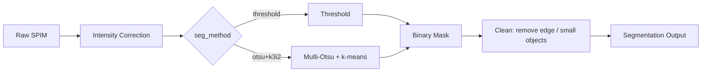

# Segmentation Methods

SPIMquant provides two built-in segmentation methods for detecting pathology signals in SPIM data, plus support for intensity correction pre-processing.  The method and correction are configured independently per stain via the `snakebids.yml` config file.

## Overview


```mermaid
flowchart LR
    A[Raw SPIM] --> B[Intensity Correction]
    B --> C{seg_method}
    C -->|threshold| D[Threshold]
    C -->|otsu+k3i2| E[Multi-Otsu + k-means]
    D --> F[Binary Mask]
    E --> F
    F --> G[Clean: remove edge / small objects]
    G --> H[Segmentation Output]
```

After segmentation the binary mask is used to compute [field fraction](../reference/outputs.md#field-fraction-map-seg), [object count](../reference/outputs.md#object-count-map-seg), and [per-object region properties](../reference/outputs.md#region-properties-statistics-table-tabular).

---

## Intensity Correction

Bias-field correction is applied before segmentation to compensate for the spatially varying illumination typical of lightsheet microscopy.

### Gaussian (`correction_method: gaussian`)

A Gaussian blur is applied to the raw image at a coarse downsampled level to estimate the low-frequency illumination profile, which is then divided out.  This is fast and requires no extra memory, making it suitable for quick iteration or large datasets.

**Config key:** `correction_method: gaussian`

### N4 (`correction_method: n4`)

ANTs N4BiasFieldCorrection is applied.  N4 fits a smooth B-spline model of the bias field and is more accurate than Gaussian correction, especially for thicker sections or strong illumination gradients.

**Config key:** `correction_method: n4`

!!! tip
    Use `n4` when high quantitative accuracy is required.  Use `gaussian` for faster exploratory runs or when the illumination gradient is mild.

---

## Segmentation Methods

### Threshold (`seg_method: threshold`)

A fixed intensity threshold is applied to the (corrected) image.  Voxels above the threshold are classified as positive; all others are negative.

The threshold value is configured per-stain:

```yaml
stain_defaults:
  abeta:
    seg_method: threshold
    seg_threshold: 500   # intensity value; adjust to your data
```

**When to use:** Works well when the pathology signal is clearly brighter than background and the intensity scale is stable across subjects.  Simple to interpret and debug.

**Limitations:** Sensitive to residual intensity non-uniformities and to between-subject intensity variation.  May require manual threshold tuning per dataset.

### Multi-Otsu (`seg_method: otsu+k3i2`)

An unsupervised thresholding method that adapts to the intensity distribution of each image.

The method string encodes two parameters: `k` — the number of Otsu classes, and `i` — the threshold index to use for the binary classification.  For `otsu+k3i2`:

1. **Multi-Otsu thresholding** — Otsu's method is extended to find `k-1` thresholds that minimise within-class variance, splitting the histogram into `k` classes.  With `k=3` the image is divided into background, low-signal, and high-signal classes (2 thresholds).
2. **Binary classification** — the threshold at index `i` (1-based) is applied to produce the final binary mask.  With `i=2` this selects the second (higher) threshold, classifying only the brightest voxels as positive.

**Config key:**

```yaml
stain_defaults:
  abeta:
    seg_method: otsu+k3i2
```

**When to use:** Preferred when the staining intensity varies across subjects or imaging sessions, because the threshold adapts automatically to each image.  Also more robust to residual illumination gradients.

**Limitations:** Can fail on images with unusual histograms (e.g. very sparse pathology that does not form a distinct peak) or when the background is very noisy.

### LANTERN plaques (`seg_method: lantern`)

The `lantern` method runs the 5-fold LANTERN amyloid-beta plaque ensemble on the
raw SPIM image at `plaque_level`, then upsamples the resulting probability map to
`segmentation_level` for downstream masking and quantification.

Unlike the histogram-based methods above, it is:

- **stain-specific** — it runs only on the first available stain from
  `stains_for_plaques`
- **GPU-based** — the workflow expects one or more visible CUDA devices
- **tile-based** — inference uses overlapping 3D tiles controlled by
  `plaque_tile` and `plaque_stride`

Overlapping tiles are merged with `plaque_merge_mode` (CLI: `--merge_mode`):

- `max` — preserves the historical LANTERN behavior by taking the maximum
  per-voxel fold-vote count over all overlapping tiles.  This remains the
  default for backward compatibility and preserves the calibration of
  `plaque_vote_threshold`.
- `average` — uniformly averages the per-tile fold-vote fractions across all
  overlapping tiles.
- `gaussian` — averages the per-tile fold-vote fractions with a Gaussian weight
  map so tile centers contribute more than tile edges.

**Example config keys:**

```yaml
seg_method:
  - lantern
plaque_merge_mode: gaussian
plaque_vote_threshold: 3
```

**When to use:** `max` is the safest option when reproducing historical runs or
relying on existing `plaque_vote_threshold` tuning.  `average` and `gaussian`
are useful when you want a more conventional sliding-window merge that requires
agreement across overlapping tiles rather than letting a single favorable tile
dominate a voxel.

**Limitations:** `average` and `gaussian` change the interpretation of overlap
aggregation, so you may need to re-tune `plaque_vote_threshold` when opting into
them.

---

## Post-Segmentation Cleaning

After the initial binary mask is produced, a cleaning step removes two classes of artefact:

1. **Edge objects** — connected components that touch the border of the field of view are removed, as these are typically cut-off tissue or slide artefacts rather than true pathology.
2. **Small objects** — objects below a minimum volume threshold (configured via `regionprop_filters`) are discarded, eliminating small noise specks.

!!! note "Scale convention"
    The output mask is stored on a **0–100 scale** (not 0–1).  This is deliberate: when the mask is spatially downsampled to compute field fraction, the resulting values are directly interpretable as a percentage (0–100 %).

---

## Per-Stain Configuration

Each stain is configured independently.  A typical `snakebids.yml` block looks like:

```yaml
stain_defaults:
  abeta:
    seg_method: otsu+k3i2
    correction_method: n4
    regionprop_filters:
      min_area: 50       # voxels; objects smaller than this are discarded
  Iba1:
    seg_method: threshold
    seg_threshold: 300
    correction_method: gaussian
```

Stains not listed in `stain_defaults` fall back to the top-level `seg_method` and `correction_method` keys.

---

## Further Reading

- [Output Files Reference](../reference/outputs.md) — description of segmentation output files
- [How SPIMquant Works Under the Hood](../workflow_overview.md#stage-7--segmentation) — pipeline context for segmentation
- [Imaris Crops](imaris_crops.md) — export patches for visual inspection