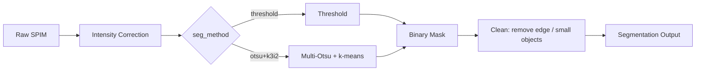

# Segmentation Methods

SPIMquant provides two built-in segmentation methods for detecting pathology signals in SPIM data, plus support for intensity correction pre-processing.  The method and correction are configured independently per stain via the `snakebids.yml` config file.

## Overview


```mermaid
flowchart LR
    A[Raw SPIM] --> B[Intensity Correction]
    B --> C{seg_method}
    C -->|threshold| D[Threshold]
    C -->|otsu+k3i2| E[Multi-Otsu + k-means]
    D --> F[Binary Mask]
    E --> F
    F --> G[Clean: remove edge / small objects]
    G --> H[Segmentation Output]
```

After segmentation the binary mask is used to compute [field fraction](../reference/outputs.md#field-fraction-map-seg), [object count](../reference/outputs.md#object-count-map-seg), and [per-object region properties](../reference/outputs.md#region-properties-statistics-table-tabular).

---

## Intensity Correction

Bias-field correction is applied before segmentation to compensate for the spatially varying illumination typical of lightsheet microscopy.

### Gaussian (`correction_method: gaussian`)

A Gaussian blur is applied to the raw image at a coarse downsampled level to estimate the low-frequency illumination profile, which is then divided out.  This is fast and requires no extra memory, making it suitable for quick iteration or large datasets.

**Config key:** `correction_method: gaussian`

### N4 (`correction_method: n4`)

ANTs N4BiasFieldCorrection is applied.  N4 fits a smooth B-spline model of the bias field and is more accurate than Gaussian correction, especially for thicker sections or strong illumination gradients.

**Config key:** `correction_method: n4`

!!! tip
    Use `n4` when high quantitative accuracy is required.  Use `gaussian` for faster exploratory runs or when the illumination gradient is mild.

---

## Segmentation Methods

### Threshold (`seg_method: threshold`)

A fixed intensity threshold is applied to the (corrected) image.  Voxels above the threshold are classified as positive; all others are negative.

The threshold value is configured per-stain:

```yaml
stain_defaults:
  abeta:
    seg_method: threshold
    seg_threshold: 500   # intensity value; adjust to your data
```

**When to use:** Works well when the pathology signal is clearly brighter than background and the intensity scale is stable across subjects.  Simple to interpret and debug.

**Limitations:** Sensitive to residual intensity non-uniformities and to between-subject intensity variation.  May require manual threshold tuning per dataset.

### Multi-Otsu (`seg_method: otsu+k3i2`)

An unsupervised thresholding method that adapts to the intensity distribution of each image.

The method string encodes two parameters: `k` — the number of Otsu classes, and `i` — the threshold index to use for the binary classification.  For `otsu+k3i2`:

1. **Multi-Otsu thresholding** — Otsu's method is extended to find `k-1` thresholds that minimise within-class variance, splitting the histogram into `k` classes.  With `k=3` the image is divided into background, low-signal, and high-signal classes (2 thresholds).
2. **Binary classification** — the threshold at index `i` (1-based) is applied to produce the final binary mask.  With `i=2` this selects the second (higher) threshold, classifying only the brightest voxels as positive.

**Config key:**

```yaml
stain_defaults:
  abeta:
    seg_method: otsu+k3i2
```

**When to use:** Preferred when the staining intensity varies across subjects or imaging sessions, because the threshold adapts automatically to each image.  Also more robust to residual illumination gradients.

**Limitations:** Can fail on images with unusual histograms (e.g. very sparse pathology that does not form a distinct peak) or when the background is very noisy.

### LANTERN plaques (`--seg_method lantern`)

A 5-fold deep-learning ensemble for amyloid-beta plaques, downloaded from Hugging Face (`apooladi/lantern-<name>`, chosen with `--lantern_config`, default `ki3-abeta@v2`).  Unlike the methods above it:

- reads **raw** intensities, not the bias-field-corrected image;
- runs on the grid nearest `plaque_iso_res` (~4 µm isotropic, the scale it was trained at); the mask at `segmentation_level` is that prediction upsampled;
- is **stain-specific**: it runs only on the first stain found in `stains_for_plaques`.  Other stains use the other methods passed to `--seg_method`, or the default method if `lantern` was the only one;
- requires a GPU.

Inference slides 128³ tiles over the volume at a stride of 64 (`plaque_tile`, `plaque_stride`), so each voxel is seen by up to 8 overlapping tiles.  Each of the 5 folds votes plaque / not plaque in every tile, and `--merge_mode` (config key `plaque_merge_mode`) decides how the tiles' vote counts are combined:

- `average` (default) — the mean over the tiles.  A tile that saw the voxel at its own edge, with little surrounding context (e.g. at the brain surface), is outvoted by the others.
- `gaussian` — a weighted mean in which each tile counts most near its centre and least near its edges.
- `max` — the highest count, as in the published LANTERN inference.  It recovers a plaque clipped at one tile's edge, but a single tile's confident mistake wins, which shows up as tiling artifacts.

The workflow saves the fold-vote fraction (`probseg`) and thresholds it downstream, so the threshold can be changed without re-running inference.  A voxel is plaque when at least `plaque_vote_threshold` of `plaque_n_folds` folds vote for it (default 3 of 5).  With `average`/`gaussian` the votes are fractional, and the cut is the midpoint below the threshold: a mean of at least 2.5 votes for the default.

Two optional filters run on the inference grid before upsampling:

- `--min_size` — drop plaque components smaller than this many voxels (default 4).
- `--label_filter` — 3-class ensembles only.  These also predict an "annotated false positive" class (bright non-plaque structure); plaques touching a false-positive component of at least `label_filter_size` voxels are dropped.  A voxel counts as false positive when at least `plaque_fp_min_votes` folds say so (default 1, "any fold").  This channel is merged with the same `--merge_mode`, so under `average`/`gaussian` a single tile's false-positive call is diluted and the filter removes fewer plaques than under `max`.

**Example:**

```bash
pixi run spimquant /bids /output participant --seg_method gmm+n3k1 lantern --merge_mode average
```

**When to use:** Amyloid-beta plaque segmentation where intensity-based thresholds struggle, e.g. with variable staining or bright non-plaque structure.  Passing both `gmm+n3k1` and `lantern` gives a like-for-like comparison on the same channel.

**Limitations:** Amyloid-beta only, needs a GPU, and results are only as good as the match between your data and the ensemble's training data.  `plaque_vote_threshold` was calibrated for `max` merging; `average` was checked at the 2.5 cut above.  Keep `segmentation_level` at or finer than `plaque_level`.

---

## Post-Segmentation Cleaning

After the initial binary mask is produced, a cleaning step removes two classes of artefact:

1. **Edge objects** — connected components that touch the border of the field of view are removed, as these are typically cut-off tissue or slide artefacts rather than true pathology.
2. **Small objects** — objects below a minimum volume threshold (configured via `regionprop_filters`) are discarded, eliminating small noise specks.

!!! note "Scale convention"
    The output mask is stored on a **0–100 scale** (not 0–1).  This is deliberate: when the mask is spatially downsampled to compute field fraction, the resulting values are directly interpretable as a percentage (0–100 %).

---

## Per-Stain Configuration

Each stain is configured independently.  A typical `snakebids.yml` block looks like:

```yaml
stain_defaults:
  abeta:
    seg_method: otsu+k3i2
    correction_method: n4
    regionprop_filters:
      min_area: 50       # voxels; objects smaller than this are discarded
  Iba1:
    seg_method: threshold
    seg_threshold: 300
    correction_method: gaussian
```

Stains not listed in `stain_defaults` fall back to the top-level `seg_method` and `correction_method` keys.

---

## Further Reading

- [Output Files Reference](../reference/outputs.md) — description of segmentation output files
- [How SPIMquant Works Under the Hood](../workflow_overview.md#stage-7--segmentation) — pipeline context for segmentation
- [Imaris Crops](imaris_crops.md) — export patches for visual inspection