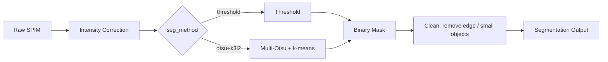

# Segmentation Methods

SPIMquant segments each stain with a mask method (`--seg_method`) and splits the mask into objects with an object method (`--object_method`).  Both are chosen **per stain**, so a panel such as Abeta + Iba1 can use LANTERN for plaques and a GMM threshold with a watershed for microglia, and still be combined in one table, colocalized and compared by distance.

## Overview


```mermaid
flowchart LR
    A[Raw SPIM] --> B[Intensity Correction]
    B --> C{seg_method}
    C -->|threshold| D[Threshold]
    C -->|otsu+k3i2| E[Multi-Otsu + k-means]
    D --> F[Binary Mask]
    E --> F
    F --> G[Clean: remove edge / small objects]
    G --> H[Segmentation Output]
```

After segmentation the binary mask is used to compute [field fraction](../reference/outputs.md#field-fraction-map-seg), [object count](../reference/outputs.md#object-count-map-seg), and [per-object region properties](../reference/outputs.md#region-properties-statistics-table-tabular).

---

## Choosing methods per stain

`--seg_method` and `--object_method` each take a list of specs.  A spec is either `STAIN=VALUE` for one stain, or a bare `VALUE` for every stain not named:

```bash
# defaults: Abeta by LANTERN (components), every other stain by gmm+n3k1 (watershed)
pixi run spimquant /bids /output participant

# Iba1 by multi-Otsu; Abeta keeps its default
pixi run spimquant /bids /output participant --seg_method Iba1=otsu+k3i2

# one method for every stain, Abeta included
pixi run spimquant /bids /output participant --seg_method gmm+n2k2p5

# no objects for NeuN: field fraction only
pixi run spimquant /bids /output participant --object_method NeuN=none
```

Precedence, highest first: `STAIN=` on the command line, a bare value on the command line, the built-in per-stain defaults, the built-in default.  The built-in defaults are the `seg_method_defaults` and `object_method_defaults` config keys: Abeta (`abeta`, `Abeta`, `BetaAmyloid`) uses `lantern` with `components`; every other stain uses `gmm+n3k1` with `watershed`.  The methods each stain resolves to are printed when the workflow starts.

Stains named in either option are segmented even if they are not in `--stains_for_seg`.

**Primary and comparison methods.**  A comma-separated list gives a stain several methods; the first is its **primary** method:

```bash
pixi run spimquant /bids /output participant --seg_method Abeta=lantern,otsu+k3i2 --object_method Iba1=watershed,components
```

Every cross-stain result uses the primary methods: the aggregated objects, colocalization, object distances, the merged per-region table (`mergedsegstats`), featuremaps and group statistics.  Comparison methods get their own per-stain outputs (mask, field fraction, counts, objects, per-region `segstats.tsv`), so they can be compared with the primary on the same channel.

**File names.**  Per-stain files carry the methods: `desc-<seg method>` on masks and mask-derived maps, and also `obj-<object method>` on per-stain object outputs, e.g. `stain-Iba1_obj-watershed_desc-gmm+n3k1_regionprops.parquet`.  Cross-stain results carry neither, e.g. `seg-roi22_from-ABAv3_mergedsegstats.tsv`; the methods are recorded in the tables' `seg_method` / `object_method` columns.

---

## Intensity Correction

Bias-field correction is applied before segmentation to compensate for the spatially varying illumination typical of lightsheet microscopy.

### Gaussian (`correction_method: gaussian`)

A Gaussian blur is applied to the raw image at a coarse downsampled level to estimate the low-frequency illumination profile, which is then divided out.  This is fast and requires no extra memory, making it suitable for quick iteration or large datasets.

**Config key:** `correction_method: gaussian`

### N4 (`correction_method: n4`)

ANTs N4BiasFieldCorrection is applied.  N4 fits a smooth B-spline model of the bias field and is more accurate than Gaussian correction, especially for thicker sections or strong illumination gradients.

**Config key:** `correction_method: n4`

!!! tip
    Use `n4` when high quantitative accuracy is required.  Use `gaussian` for faster exploratory runs or when the illumination gradient is mild.

### None (`correction_method: none`) and log (`correction_method: log`)

No bias field: the raw intensities (`none`), or their `log1p` (`log`), set to zero outside the brain mask.  The image is read and written once, with no bias-field fit, upsampling or full-resolution intermediates, so this is much lighter than `n4`.  The brain mask is still applied because downstream steps treat zero as outside the brain.

These are meant for methods that respond to local contrast rather than absolute intensity, such as DoG blobs (`dog+...`) and ML models.  Thresholds in absolute intensity units (`th<value>`, a numeric `instance_h`, or its fallback) are then on the raw or log scale.  With `log`, the DoG pool threshold is applied as a ratio (`median + log(dog_pool_factor)`).

On marmoset pS129 aSyn crops, `dog+s3r4k6` masks from `none` agreed closely with those from N4-corrected intensities (median Dice 0.93; lowest, 0.75–0.81, where the bias field was far from typical).  `log` is not equivalent at the same `k`: in log space the DoG responds to relative contrast, which removed most detections in bright, high-background regions (median Dice 0.75), so it needs its own tuning.

**Config key:** `correction_method: none` (or `log`)

---

## Segmentation Methods

### Threshold (`--seg_method th<value>`)

A fixed intensity threshold is applied to the (corrected) image.  Voxels above the threshold are classified as positive; all others are negative.

The threshold is part of the method name, e.g. `--seg_method Abeta=th500`.

**When to use:** Works well when the pathology signal is clearly brighter than background and the intensity scale is stable across subjects.  Simple to interpret and debug.

**Limitations:** Sensitive to residual intensity non-uniformities and to between-subject intensity variation.  May require manual threshold tuning per dataset.

### Multi-Otsu (`--seg_method otsu+k3i2`)

An unsupervised thresholding method that adapts to the intensity distribution of each image.

The method string encodes two parameters: `k` — the number of Otsu classes, and `i` — the threshold index to use for the binary classification.  For `otsu+k3i2`:

1. **Multi-Otsu thresholding** — Otsu's method is extended to find `k-1` thresholds that minimise within-class variance, splitting the histogram into `k` classes.  With `k=3` the image is divided into background, low-signal, and high-signal classes (2 thresholds).
2. **Binary classification** — the threshold at index `i` (1-based) is applied to produce the final binary mask.  With `i=2` this selects the second (higher) threshold, classifying only the brightest voxels as positive.

**Example:** `--seg_method Abeta=otsu+k3i2`

**When to use:** Preferred when the staining intensity varies across subjects or imaging sessions, because the threshold adapts automatically to each image.  Also more robust to residual illumination gradients.

**Limitations:** Can fail on images with unusual histograms (e.g. very sparse pathology that does not form a distinct peak) or when the background is very noisy.

### DoG blobs (`--seg_method dog+s3r4k6`)

Difference-of-Gaussians blob detection, for small punctate signal (e.g. pS129 alpha-synuclein inclusions) that is much dimmer than the brightest structures in the image.  Global histogram methods such as `gmm+n3k1` put their threshold in the bright tail, which picks up stain pooling on the brain surface and misses the puncta.  DoG responds to how much brighter a spot is than its surroundings, at a given size, rather than to absolute intensity.

The method string encodes three parameters, with `p` as the decimal separator (`dog+s2p5r4k6` → s=2.5):

- `s` — sigma of the inner Gaussian in **micrometres**, set to roughly the radius of the features of interest.  It is converted to voxels per axis, so anisotropic voxels are handled.
- `r` — ratio of the outer (background) to the inner sigma.
- `k` — threshold in robust standard deviations: `median + k × 1.4826 × MAD` of the DoG response, estimated from tissue voxels in a random subset of chunks.

The steps are:

1. **DoG response** `G(s) − G(r·s)`, computed chunkwise.  The bias-corrected image is zero outside the brain mask, so both blurs are mask-normalised (`G(I·M)/G(M)`); otherwise the brain edge would light up.
2. **Pool exclusion.**  Bright, large regions (e.g. stain pooling on the surface or in sulci) also give a DoG response along their rim.  On a pyramid level `dog_pool_level_offset` levels coarser than `segmentation_level`, connected components brighter than `dog_pool_factor` × the tissue median and larger than `dog_pool_min_volume_um3` are taken as pools.  Their mask is upsampled, refined at full resolution, dilated by `dog_pool_dilate_um`, and DoG-positive voxels inside it are dropped.  Bright puncta are kept: they are orders of magnitude smaller than the volume cutoff.

Besides the mask, the rule writes a `thresholds.png` QC histogram of the DoG response and a low-resolution `poolmask.nii.gz`.

**Example:**

```bash
pixi run spimquant /bids /output participant --seg_method aSyn=dog+s3r4k6
```

**Tuning:** `dog+s3r4k6` and the default `dog_pool_*` values were tuned on marmoset pS129 aSyn at 3.5 × 3.5 × 5 µm, where puncta are about 10–20 µm across at half maximum.  `s=3` also captures beaded neurite-like processes; `dog+s5r4k8` is more conservative and keeps only the most distinct puncta.  Lower `dog_pool_factor` if moderately bright surface signal still comes through.

**Limitations:** Large but genuine positive structures (bigger than a few times `r·s`) are suppressed by design, as are features within `dog_pool_dilate_um` of a pool.

#### Tuning report (`tune_dog`)

The `tune_dog` analysis level writes an HTML report (and a JSON of all numbers) per subject and stain, to help choose `s` and `k`:

```bash
pixi run spimquant /bids /output tune_dog --stains-for-seg aSyn --correction_method none
```

Output: `qc/..._stain-<stain>_level-<level>_desc-dog_tunereport.html`.  On a sample of `dog_tune_blocks` tissue-rich blocks (the first of the blocks dogthresh uses for its statistics, so k means the same as in a `dogthresh` run), for every `s` in `dog_tune_s_um` and `k` in `dog_tune_k` at `r = dog_tune_ratio`, it reports:

- **Contrast detection limits.**  Synthetic puncta (3D Gaussians of sd `dog_tune_spike_sd_um`) are added to background tissue at known contrast, i.e. peak height relative to the local (12 µm) background, and the contrast at which 50% and 90% are detected is found.  This translates k into "detects puncta that are X% brighter than their surroundings".
- **Noise FDR.**  Objects found in a structureless image with the measured, intensity-dependent noise, divided by objects found in the real image.  In the marmoset pS129 aSyn data this is negligible from s = 3 µm: the robust sd that sets the k units comes from real tissue texture, not camera noise, so k cannot be derived from noise and acts as a contrast criterion.
- **Object density and masked volume** per (s, k), and **montages** of the masks on three blocks.
- **Scale census**: the sd of the strongest blobs, from scale-space maxima of the Laplacian of Gaussian.
- **Suggested k** for each s: the largest k that detects `dog_tune_target_recall` of puncta of sd `dog_tune_target_spike_sd_um` at `dog_tune_target_contrast`, provided the noise FDR is at most `dog_tune_max_noise_fdr`.

k units depend on the image, so the same k corresponds to a different contrast in another subject: tune on representative subjects, then fix `s` and `k` for the study.

### LANTERN plaques (`--seg_method lantern`)

A 5-fold deep-learning ensemble for amyloid-beta plaques, downloaded from Hugging Face (`apooladi/lantern-<name>`, chosen with `--lantern_config`, default `abeta`).  Unlike the methods above it:

- reads **raw** intensities, not the bias-field-corrected image;
- runs on the grid nearest `plaque_iso_res` (~4 µm isotropic, the scale it was trained at); the mask at `segmentation_level` is that prediction upsampled;
- is the **built-in default for amyloid-beta** (`abeta`, `Abeta`, `BetaAmyloid`); it can be given for another stain (`--seg_method STAIN=lantern`), with a warning, as the ensembles are trained on amyloid-beta;
- requires a GPU.

Inference slides 128³ tiles over the volume at a stride of 64 (`plaque_tile`, `plaque_stride`), so each voxel is seen by up to 8 overlapping tiles.  Each of the 5 folds votes plaque / not plaque in every tile, and `--merge_mode` (config key `plaque_merge_mode`) decides how the tiles' vote counts are combined:

- `gaussian` (default) — a weighted mean in which each tile counts most near its centre and least near its edges.
- `average` — the plain mean over the tiles.  A tile that saw the voxel at its own edge, with little surrounding context (e.g. at the brain surface), is outvoted by the others.
- `max` — the highest count, as in the published LANTERN inference.  It recovers a plaque clipped at one tile's edge, but a single tile's confident mistake wins, which shows up as tiling artifacts.

The workflow saves the fold-vote fraction (`probseg`) and thresholds it downstream, so the threshold can be changed without re-running inference.  A voxel is plaque when at least `plaque_vote_threshold` of `plaque_n_folds` folds vote for it (default 3 of 5).  With `average`/`gaussian` the votes are fractional, and the cut is the midpoint below the threshold: a mean of at least 2.5 votes for the default.

**Which ensemble.** The default `abeta` is trained on every hand-reviewed amyloid-beta patch LANTERN has — 178 patches from 68 mice, pooled across the lecanemab, vaccine, ApoE, fibrinogen and MAPT/APOE cohorts — so it is the general-purpose choice.  The cohort-specific siblings (`ki3-abeta@v2` for lecanemab, `mapt_a-abeta` / `mapt_b-abeta` / `mapt_c-abeta`) remain available and run unchanged.  `abeta` is binary, so `--label_filter` does not apply to it; the MAPT ensembles are 3-class.  Its Hugging Face repo carries no tag, so the default tracks `main` — pass `abeta@<commit>` to pin a run against a later upload.

**Bottleneck conditioner.** Per-tile clip-and-z-score normalisation deliberately removes each tile's absolute brightness, which also hides information a plaque segmenter can use.  `abeta` therefore takes two extra inputs per tile — the mean and standard deviation of its **raw** intensities, as `log1p` and standardised with per-fold constants stored in the checkpoints — projects them to 32 features and mixes them into the network's bottleneck.  Nothing needs configuring: the script reads whether an ensemble wants them from the checkpoints themselves, measures them on each tile before normalisation, and errors out rather than guessing if a checkpoint and its metadata disagree.  Ensembles without a conditioner are unaffected.

Two optional filters run on the inference grid before upsampling:

- `--min_size` — drop plaque components smaller than this many voxels (default 4).
- `--label_filter` — 3-class ensembles only.  These also predict an "annotated false positive" class (bright non-plaque structure); plaques touching a false-positive component of at least `label_filter_size` voxels are dropped.  A voxel counts as false positive when at least `plaque_fp_min_votes` folds say so (default 1, "any fold").  This channel is merged with the same `--merge_mode`, so under `average`/`gaussian` a single tile's false-positive call is diluted and the filter removes fewer plaques than under `max`.

**Example:**

```bash
# LANTERN is the Abeta default; add gmm+n3k1 as a comparison on the same channel
pixi run spimquant /bids /output participant --seg_method Abeta=lantern,gmm+n3k1
```

**When to use:** Amyloid-beta plaque segmentation where intensity-based thresholds struggle, e.g. with variable staining or bright non-plaque structure.  Without a GPU, give Abeta another method (`--seg_method Abeta=gmm+n3k1`, or a bare method for every stain).

**Limitations:** Amyloid-beta only, needs a GPU, and results are only as good as the match between your data and the ensemble's training data.  `plaque_vote_threshold` was calibrated for `max` merging; the averaging modes (`gaussian`, the default, and `average`) take the midpoint cut described above rather than a separately recalibrated threshold.  Keep `segmentation_level` at or finer than `plaque_level`.

---

## Post-Segmentation Cleaning

After the initial binary mask is produced, a cleaning step removes two classes of artefact:

1. **Edge objects** — connected components that touch the border of the field of view are removed, as these are typically cut-off tissue or slide artefacts rather than true pathology.
2. **Small objects** — objects below a minimum volume threshold (configured via `regionprop_filters`) are discarded, eliminating small noise specks.

!!! note "Scale convention"
    The output mask is stored on a **0–100 scale** (not 0–1).  This is deliberate: when the mask is spatially downsampled to compute field fraction, the resulting values are directly interpretable as a percentage (0–100 %).

---

## Objects (`--object_method`)

Counts, density, the per-object tables, colocalization and object distances need the mask split into objects.  Field fraction comes from the mask itself and does not depend on this choice.  The object method is chosen per stain, with the same syntax as `--seg_method`.

- `watershed` (built-in default, except for amyloid-beta) — a seeded watershed assigns every mask voxel to a seed, so touching cells or puncta are counted separately:
    1. The corrected image is smoothed with a Gaussian of `instance_sigma_um` (3 µm).
    2. Seeds are local maxima of the smoothed image inside the mask, at least `instance_min_dist_um` (4 µm) apart, that rise at least **h** above the dip separating them from a brighter neighbour.  Every connected component gets at least one seed.
    3. The watershed floods the negated smoothed image within the mask.

  Objects have the same columns as `components` plus `seed_x/y/z`, `mean_intensity`, `max_intensity`, `peak_intensity` and `elongation` (1 for a sphere; neurite-like segments are elongated).  Objects smaller than `instance_min_volume_um3` (1000 µm³) are dropped.  An `obj-watershed_..._instances.json` file next to the parquet records the parameters used, including h.
- `components` (built-in default for amyloid-beta) — connected components.  Simple, but touching objects merge: in dense tissue a single "object" can be a network of hundreds of puncta, so counts are too low and sizes too large.  Compact plaques with several dense cores are better kept whole this way.
- `none` — no objects: the stain gets field fraction and volume only.

The old `cc` / `inst` names and the `+inst` suffix on `--seg_method` are rejected with a message naming the replacement.

**h**, the seed prominence, controls the trade-off: lower values split touching puncta more readily but also split single puncta on noise.  With `instance_h: auto` (default) it is `instance_h_noise_k` (3) × the noise sd, estimated as the 25th percentile, across tissue-rich chunks, of the robust sd of the high-pass residual outside the mask.  A number sets h directly in corrected-intensity units; `instance_h_fallback` (7) is used when the noise cannot be estimated.

Give both to compare them on the same masks (the first is primary):

```bash
pixi run spimquant /bids /output participant --seg_method aSyn=dog+s3r4k6 --object_method aSyn=watershed,components
```

Mask-only QC (segslices, ROI montages, z-profiles, patches) is made once per seg method; object-based QC once per seg method and object method.

**Validation** (marmoset pS129 aSyn, `dog+s3r4k6`): on synthetic puncta, instances found every isolated punctum with no false seeds, and split pairs of equally bright puncta from about 4σ apart, where connected components never split them.  On real dense cortex they gave 1.4–2.3× the connected-component count, and the largest instance was ~1×10⁵ µm³ against up to 6×10⁷ µm³ for connected components.  In sparse regions 6–11% of single puncta still get two seeds, and in tight clusters some puncta remain merged, so dense-region counts are still a lower bound.  Results are independent of the chunk size.

**Cost:** roughly the same as the DoG segmentation itself.  It reads the corrected image, so on an existing run whose corrected image has been removed, adding `watershed` recomputes the bias-field correction (and, as a consequence, the mask).

---

## Distances between objects

Every object of every stain with objects is written to one table, `tabular/*_space-<template>_regionprops.parquet`, from each stain's primary methods, with distance columns (all in mm, computed from subject-space centroids):

- `<stain>_dist` — for every stain with objects: distance to the nearest object of that stain (for objects of the same stain, the nearest *other* one).
- `<stain>_edgedist` — that distance minus the nearest object's equivalent-sphere radius (from its volume), clipped at 0: an approximate distance to its surface, so a cell touching a large plaque reads ~0 rather than the plaque's radius.
- `<stain>_sdt` — the signed distance transform of the vessel mask (when vessels are run) at the centroid: negative inside a vessel, positive outside.  Other stains' masks can be added with the `sdt_stains` config key; their SDT is costly at `segmentation_level` and saturates a few tens of voxels from the mask, so `<stain>_dist` is the better measure for sparse objects.

Their per-region means appear in the merged table as `<stain>+<other stain>_dist` etc.

---

## Per-Stain Configuration

Beyond `--seg_method` and `--object_method`, the minimum object size for `components` is set per stain under `stain_defaults.regionprop_filters` (stains not listed use the top-level `regionprop_filters`):

```yaml
stain_defaults:
  regionprop_filters:
    YoPro:
      area:
        - ">="
        - 100
```

To change a stain's built-in methods for every run (e.g. once a model is validated for it), edit `seg_method_defaults` / `object_method_defaults`.

---

## Further Reading

- [Output Files Reference](../reference/outputs.md) — description of segmentation output files
- [How SPIMquant Works Under the Hood](../workflow_overview.md#stage-7--segmentation) — pipeline context for segmentation
- [Imaris Crops](imaris_crops.md) — export patches for visual inspection