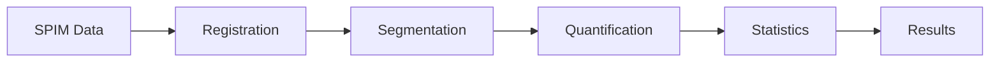

# SPIMquant Documentation

Welcome to the documentation for **SPIMquant**, a Snakemake-based BIDS app for quantitative analysis of SPIM (lightsheet) brain data.

## Overview

SPIMquant performs automated nonlinear template registration and quantification of pathology from SPIM microscopy datasets. It bridges the gap between raw microscopy data and quantitative brain analysis through a robust, scalable workflow.

## Key Features

- **Deformable Registration**: High-quality template registration using greedy and ANTs
- **Atlas-Based Quantification**: Automated quantification of pathology using brain atlases
- **High-Resolution Crops**: Create Imaris dataset crops from atlas region bounding boxes
- **Group-Level Statistics**: Statistical analysis with contrast comparisons across experimental groups
- **Parallelization**: Efficient processing using Snakemake and Dask for both coarse and fine-grained tasks
- **Cloud Support**: Direct reading from cloud-based object storage (S3, GCS)
- **Scalable Processing**: Simple deployment on cloud infrastructure with Coiled integration

## Supported Templates

SPIMquant supports multiple brain templates for registration:

- **ABAv3**: Allen Brain Atlas version 3
- **gubra**: Gubra mouse brain atlas
- **MBMv3**: Marmoset Brain Maps version 3
- **turone**: Turone mouse brain atlas
- **MouseIn**: Mouse MRI template

## Quick Links

- **[Installation](getting_started/installation.md)**: Get started with SPIMquant
- **[Quick Start](getting_started/quickstart.md)**: Run your first workflow
- **[CLI Reference](usage/cli.md)**: Command-line interface documentation
- **[Examples](examples/workflows.md)**: See SPIMquant in action
- **[Contributing](contributing.md)**: Help improve SPIMquant

## Workflow Overview



The typical SPIMquant workflow:

1. **Input**: BIDS-formatted SPIM microscopy data (OME-Zarr format)
2. **Registration**: Deformable registration to a reference template
3. **Segmentation**: Automated segmentation of pathology signals
4. **Quantification**: Atlas-based regional quantification
5. **Statistics**: Group-level statistical analysis and visualization

## Getting Help

- **Issues**: Report bugs or request features on [GitHub Issues](https://github.com/khanlab/SPIMquant/issues)
- **Discussions**: Ask questions on [GitHub Discussions](https://github.com/khanlab/SPIMquant/discussions)
- **FAQ**: Check the [FAQ page](faq.md) for common questions

## Citation

If you use SPIMquant in your research, please cite:

<!-- TODO: Add citation information once paper is published -->

```
Citation information coming soon
```

## License

SPIMquant is licensed under the MIT License. See the [LICENSE](https://github.com/khanlab/SPIMquant/blob/main/LICENSE) file for details.
