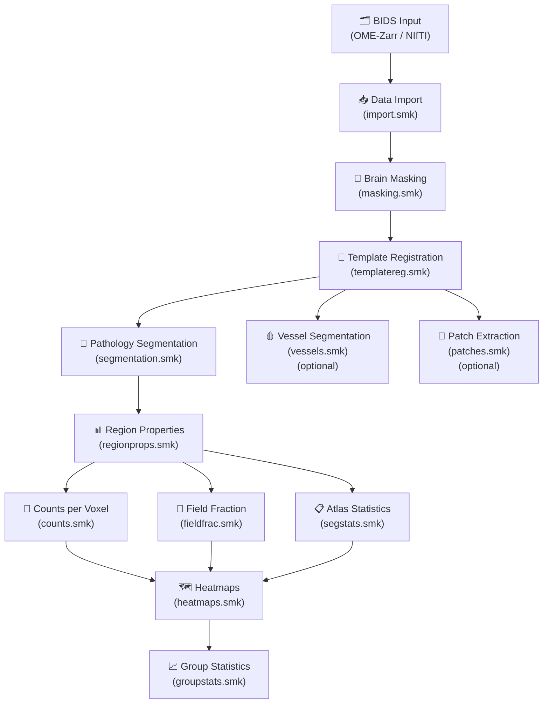
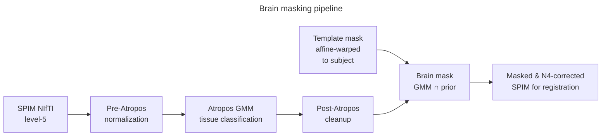
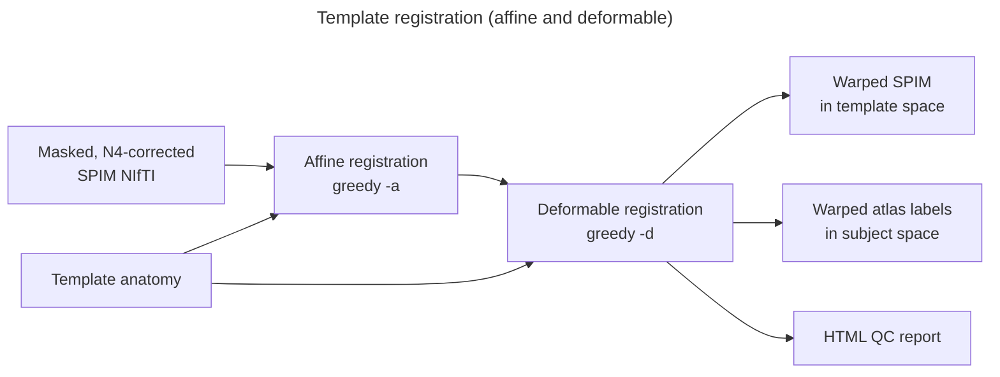
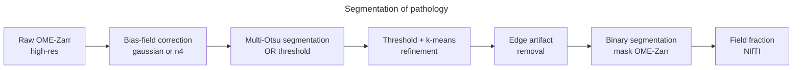
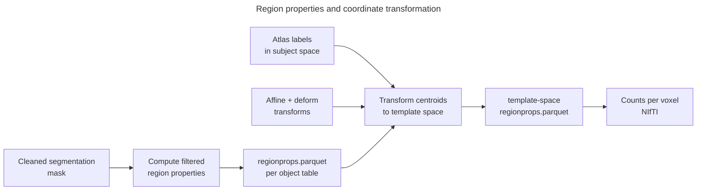

# How SPIMquant Works

This page provides a high-level overview of SPIMquant's processing pipeline, describing each
major workflow stage and how they connect to produce quantitative results from raw SPIM data.

## Pipeline Architecture

SPIMquant is built as a [Snakemake](https://snakemake.readthedocs.io/) workflow with a
[snakebids](https://snakebids.readthedocs.io/) wrapper that makes it a BIDS App. The workflow
is organized into modular rule files (`.smk`) that each handle a specific processing stage.
Snakemake manages dependencies between stages, enabling efficient parallel execution and
automatic resumption after interruptions.

The workflow targets two analysis levels:

- **`participant`**: Processes each subject independently through registration, segmentation, and quantification.
- **`group`**: Aggregates participant results and performs statistical comparisons across groups.

### Overall Pipeline



---

## Stage 1 — Data Import (`import.smk`)

**Purpose**: Make all inputs available in BIDS-compliant NIfTI format and populate the resource
directory with the chosen reference template, brain mask, and atlas segmentation files.

```mermaid
---
title: Import and setup templates, masks, and atlases
---
flowchart LR
    Z[OME-Zarr Input] --> NII[NIfTI at each resolution level]
    TPL[Template URL / path] --> ANAT[tpl-{template}_anat.nii.gz]
    MSK[Mask URL / path]     --> BMSK[tpl-{template}_mask.nii.gz]
    DSG[Atlas URL / path]    --> DSEG[tpl-{template}_dseg.nii.gz]
    LUT[Atlas TSV]           --> LTSV[tpl-{template}_dseg.tsv]
```

### What happens here

1. **OME-Zarr → NIfTI conversion** (`get_downsampled_nii`): The multi-scale OME-Zarr pyramid
   is read using [zarrnii](https://github.com/khanlab/zarrnii). The requested resolution level
   (e.g., `level=5` ≈ 32× downsampled) is extracted and saved as a NIfTI file.  The orientation
   is corrected according to the `orientation` config key (default: `RAS`).

2. **Template & atlas download** (`import_template_anat`, `import_mask`, `import_dseg`,
   `import_lut_tsv`): The template anatomy image, brain mask, atlas discrete segmentation
   (`dseg.nii.gz`), and label look-up table (`dseg.tsv`) are downloaded from the URLs in the
   configuration (or copied from local `resources/` paths) into a per-template directory.

3. **LUT conversion** (`generic_lut_bids_to_itksnap`): Atlas label tables are also converted
   to ITK-SNAP colour table format for interactive visualization.

### Key outputs

| File | Description |
|------|-------------|
| `sub-*/micr/*_stain-{stain}_level-{level}_SPIM.nii.gz` | Downsampled NIfTI from OME-Zarr |
| `tpl-{template}/tpl-{template}_anat.nii.gz` | Template anatomy (reference) image |
| `tpl-{template}/tpl-{template}_desc-brain_mask.nii.gz` | Template brain mask |
| `tpl-{template}/tpl-{template}_seg-{atlas}_dseg.nii.gz` | Atlas parcellation labels |
| `tpl-{template}/tpl-{template}_seg-{atlas}_dseg.tsv` | Atlas region look-up table |

---

## Stage 2 — Brain Masking (`masking.smk`)

**Purpose**: Identify brain tissue within each subject's SPIM volume so that subsequent
registration and segmentation operate only on relevant voxels.



### What happens here

1. **Affine prior registration** (`init_affine_reg`, `affine_transform_template_mask_to_subject`):
   A quick linear registration brings the template brain mask into approximate subject space,
   providing a spatial prior for the GMM tissue classifier.

2. **Gaussian Mixture Model segmentation** (`pre_atropos`, `atropos_seg`, `post_atropos`):
   ANTs [Atropos](https://github.com/ANTsX/ANTs) performs GMM-based tissue classification
   using the affine-warped template mask as a spatial prior.  A three-class model separates
   background, partial-volume, and brain tissue.

3. **Mask refinement** (`create_mask_from_gmm_and_prior`): The GMM result is intersected with
   the affine-warped template mask to eliminate false positives.  The final mask is used for
   N4 bias-field correction in the registration stage.

### Key outputs

| File | Description |
|------|-------------|
| `sub-*/micr/*_stain-{stain}_level-{level}_desc-brain_mask.nii.gz` | Binary brain mask for this subject/stain/level |

---

## Stage 3 — Template Registration (`templatereg.smk`)

**Purpose**: Establish a spatial correspondence between each subject's SPIM data and the chosen
reference template.  This is the most computationally intensive stage and determines the quality
of all downstream atlas-based measurements.



### What happens here

1. **N4 bias-field correction** (`n4`): ANTs `N4BiasFieldCorrection` removes low-frequency
   intensity gradients caused by the lightsheet illumination profile.  Both the corrected image
   and the estimated bias field are saved.

2. **Affine registration** (`init_affine_reg`, `affine_reg`): `greedy` (or ANTs) performs a
   rigid + affine registration of the masked, bias-corrected SPIM volume to the template.
   The resulting transformation matrix is stored for use in the deformable step.

3. **Deformable registration** (`deform_reg`): A diffeomorphic deformable registration (`greedy
   -d`) refines the affine result.  The forward warp (subject → template) and inverse warp
   (template → subject) are both saved.

4. **Compose transformations** (`compose_subject_to_template_warp`): Affine and deformable
   transforms are composed into a single composite warp field for efficient application.

5. **Transform subject image to template** (`deform_spim_nii_to_template_nii`): The SPIM
   volume is resampled into template space using the composite warp.

6. **Transform atlas labels to subject** (`deform_template_dseg_to_subject_nii`): The atlas
   discrete segmentation (`dseg`) is warped back into subject space using the inverse warp,
   enabling region-based measurements on the native high-resolution data.

7. **QC report** (`registration_qc_report`): An HTML report is generated that overlays the
   SPIM image on the template (and vice versa) for visual quality assessment.

### Key outputs

| File | Description |
|------|-------------|
| `sub-*/micr/*_space-{template}_SPIM.nii.gz` | SPIM warped into template space |
| `sub-*/micr/*_desc-N4_SPIM.nii.gz` | Bias-field corrected SPIM (subject space) |
| `sub-*/micr/*_desc-N4_biasfield.nii.gz` | Estimated bias field |
| `sub-*/micr/*_desc-affine_xfm.txt` | Affine transformation matrix |
| `sub-*/micr/*_desc-deform_xfm.nii.gz` | Deformable warp field (subject → template) |
| `sub-*/micr/*_desc-invdeform_xfm.nii.gz` | Inverse warp field (template → subject) |
| `sub-*/micr/*_desc-deform_seg-{atlas}_dseg.nii.gz` | Atlas labels in subject space |
| `sub-*/micr/*_space-{template}_desc-reg_SPIM.html` | Registration QC report |

---

## Stage 4 — Pathology Segmentation (`segmentation.smk`)

**Purpose**: Detect and label pathology signal (e.g., amyloid plaques, Iba1-positive microglia)
in the high-resolution SPIM data.



### What happens here

1. **Intensity correction** (`gaussian_biasfield` or `n4_biasfield`): Before segmentation,
   the high-resolution OME-Zarr data is bias-corrected to reduce systematic intensity
   gradients.  The `--correction_method` flag chooses between a fast Gaussian smoothing
   approach (`gaussian`) and the more accurate ANTsPy N4 method (`n4`).

2. **Multi-Otsu segmentation** (`multiotsu`): The corrected volume is segmented using a
   multi-class Otsu threshold. The `--seg_method` configuration selects the algorithm:
    - `threshold`: simple global threshold
    - `otsu+k3i2`: multi-Otsu initial threshold followed by k-means (3 classes, 2
      iterations) for refinement.

3. **Threshold application** (`threshold`): Objects below the intensity threshold defined by
   the Otsu step are removed, producing an initial binary candidate mask.

4. **Filtering** (`compute_filtered_regionprops`): Detected objects are filtered by minimum
   area (default ≥ 200 voxels, controlled by `regionprop_filters`) and by distance from the
   brain mask edge to eliminate edge artefacts.

5. **Field fraction** (`fieldfrac`): The binary mask is downsampled to match the registration
   resolution and the fraction of brain voxels occupied by pathology signal is computed for
   each voxel (values are scaled 0–100 representing percent occupancy).

!!! note "Segmentation mask scaling"
    Segmentation masks are stored at values 0 and **100** (not 0/1). This ensures that when
    downsampling for field fraction, the resulting values directly represent the percentage
    of occupied tissue (0–100%).

### Key outputs

| File | Description |
|------|-------------|
| `sub-*/micr/*_stain-{stain}_seg-{method}_desc-cleaned_mask.ozx` | Binary segmentation mask (OME-Zarr, 0/100) |
| `sub-*/micr/*_stain-{stain}_level-{reg_level}_fieldfrac.nii.gz` | Field fraction NIfTI |
| `sub-*/micr/*_stain-{stain}_level-{reg_level}_space-{template}_fieldfrac.nii.gz` | Field fraction in template space |

---

## Stage 5 — Region Properties (`regionprops.smk`)

**Purpose**: Extract per-object measurements (centroid, volume) from the segmentation mask and
map them into atlas region space.



### What happens here

1. **Region property extraction** (`compute_filtered_regionprops`): `skimage.measure.regionprops`
   is applied to the segmentation mask. For each connected component the centroid coordinates
   and area (number of voxels) are recorded.

2. **Coordinate transformation** (`transform_regionprops_to_template`): The centroid
   coordinates are transformed from subject space to template space using the composite warp,
   enabling aggregation across subjects.

3. **Cross-stain aggregation** (`aggregate_regionprops_across_stains`): When multiple
   segmentation stains are present, the per-stain parquet files are merged and colocalization
   relationships are computed.

4. **Counts per voxel** (`counts_per_voxel`, `counts_per_voxel_template`): A volumetric
   density map is created by binning object centroids into voxels at the registration resolution,
   producing a count-per-voxel NIfTI image in both subject and template space.

5. **Atlas ROI mapping** (`map_regionprops_to_atlas_rois`): Each detected object centroid is
   assigned to an atlas region based on its voxel coordinates in the warped `dseg` volume.
   The result is a table of per-object region labels.

### Key outputs

| File | Description |
|------|-------------|
| `sub-*/micr/*_stain-{stain}_desc-filtered_regionprops.parquet` | Per-object measurements (subject space) |
| `sub-*/micr/*_stain-{stain}_space-{template}_regionprops.parquet` | Per-object measurements (template space) |
| `sub-*/micr/*_stain-{stain}_level-{level}_desc-filtered_count.nii.gz` | Counts per voxel (subject space) |
| `sub-*/micr/*_stain-{stain}_space-{template}_level-{level}_count.nii.gz` | Counts per voxel (template space) |

---

## Stage 6 — Quantification (`segstats.smk`, `fieldfrac.smk`, `counts.smk`)

**Purpose**: Aggregate individual object measurements into per-region atlas statistics.

### What happens here

For each atlas region defined in the `dseg` label file, the following metrics are computed:

| Metric | Description |
|--------|-------------|
| `count` | Total number of detected objects in the region |
| `density` | Count per unit brain volume (objects per mm³) |
| `fieldfrac` | Mean percentage of region voxels occupied by pathology signal (0–100%) |
| `volume` | Total volume of detected objects in the region (mm³) |
| `nvoxels` | Total number of segmentation voxels in the region |

When multiple stains are present, additional **colocalization** metrics are computed:

| Metric | Description |
|--------|-------------|
| `overlapratio` | Fraction of objects from stain A that overlap with objects from stain B |
| `distance` | Mean nearest-neighbour distance between objects of different stains |
| `density` (coloc) | Density of colocalized objects |
| `count` (coloc) | Count of colocalized object pairs |

The per-stain and colocalization statistics are merged into a combined TSV file
(`mergedsegstats.tsv`) for each subject.

### Key outputs

| File | Description |
|------|-------------|
| `sub-*/micr/*_stain-{stain}_seg-{atlas}_from-{template}_desc-{atlas}_segstats.tsv` | Per-region statistics for one stain |
| `sub-*/micr/*_seg-{atlas}_from-{template}_desc-{atlas}_mergedsegstats.tsv` | Merged statistics for all stains |

---

## Stage 7 — Heatmaps (`heatmaps.smk`)

**Purpose**: Create volumetric NIfTI images where each atlas region is painted with its
quantitative value, enabling visualization of spatial patterns across the brain.

For each metric in `mergedsegstats.tsv` (density, fieldfrac, count, volume, etc.) a separate
NIfTI volume is created in both template space and subject space.  These images can be
loaded in standard neuroimaging viewers (e.g., ITK-SNAP, FSLeyes, 3D Slicer) alongside the
template anatomy for intuitive spatial interpretation.

### Key outputs

| File | Description |
|------|-------------|
| `sub-*/micr/*_space-{template}_desc-{atlas}_{metric}.nii.gz` | Per-region heatmap in template space |
| `sub-*/micr/*_level-{level}_from-{template}_desc-{atlas}_{metric}.nii.gz` | Per-region heatmap in subject space |
| `sub-*/micr/*_stain-{stain}_space-{template}_fieldfrac.nii.gz` | Field fraction map in template space |

---

## Stage 8 — Group Statistics (`groupstats.smk`)

**Purpose**: Compare regional pathology burden across experimental groups using statistical tests.

```mermaid
---
title: Group-level analysis
---
flowchart LR
    TSV["mergedsegstats.tsv\n(all subjects)"]
    PTAB[participants.tsv\ngroup labels]
    TSV --> GROUPSTATS[Group statistics\nt-test / Cohen's d]
    PTAB --> GROUPSTATS
    GROUPSTATS --> GTAB[groupstats.tsv]
    GTAB --> HMAP[Heatmap PNG]
    GTAB --> GNII[Statistical NIfTI\ntstat / pval / cohensd]
    PARQ[regionprops.parquet\n(all subjects)] --> CNII[Count NIfTI\n(per contrast)]
```

### What happens here

1. **Aggregate segstats** (`perform_group_stats`): The `mergedsegstats.tsv` from every subject
   is loaded along with `participants.tsv`.  A two-sample t-test and effect size (Cohen's *d*)
   are computed for each atlas region and each metric, comparing the two groups specified by
   `--contrast_column` and `--contrast_values`.

2. **Statistical heatmap** (`create_stats_heatmap`): A PNG heatmap is produced showing
   t-statistics and p-values for each region, sorted by effect size.

3. **Statistical NIfTI maps** (`map_groupstats_to_template_nii`): Each statistical measure
   (t-statistic, p-value, Cohen's *d*) is painted onto the atlas parcellation in template
   space, producing a volumetric brain map.

4. **Group-averaged maps** (`concat_subj_segstats_contrast`, `map_groupavg_segstats_to_template_nii`):
   Per-contrast average heatmaps show the mean regional burden for each experimental group.

5. **Voxel-wise density maps** (`group_counts_per_voxel`, `group_counts_per_voxel_contrast`):
   All per-subject `regionprops.parquet` files are merged and binned into template-space voxels,
   creating a continuous density map of pathology centroids across the entire dataset.

### Key outputs

| File | Description |
|------|-------------|
| `group/seg-{atlas}_from-{template}_desc-{atlas}_groupstats.tsv` | Region-level statistics table |
| `group/seg-{atlas}_from-{template}_desc-{atlas}_groupstats.png` | Heatmap of statistical results |
| `group/seg-{atlas}_space-{template}_desc-{atlas}_{metric}_{stat}.nii.gz` | Statistical brain map (tstat/pval/cohensd) |
| `group/space-{template}_level-{level}_desc-{atlas}_{stain}+count.nii.gz` | Voxel-wise density map |
| `group/space-{template}_desc-{atlas}_contrast-*_groupavg.nii.gz` | Group-averaged regional heatmap |

---

## Optional Stages

### Vessel Segmentation (`vessels.smk`)

When a vessel stain (e.g., `CD31`, `Lectin`) is detected, SPIMquant optionally runs the
[VesselFM](https://github.com/JonahCzernof/VesselFM) deep-learning model to segment the
cerebral vasculature from the high-resolution OME-Zarr data.  A signed distance transform
is then computed from the vessel mask.

!!! note "Signed distance convention"
    Signed distance transform values are **negative inside** the vessel mask and **positive
    outside** (computed as `dt_outside - dt_inside`).

| File | Description |
|------|-------------|
| `sub-*/micr/*_stain-{stain}_level-{level}_desc-vesselfm_mask.ozx` | Vessel segmentation mask (OME-Zarr) |
| `sub-*/micr/*_stain-{stain}_level-{level}_desc-*_dist.ozx` | Signed distance transform (OME-Zarr) |

### Patch Extraction (`patches.smk`)

Fixed-size 3D patches (default 256³ voxels) are extracted from the high-resolution SPIM data
centred on randomly sampled locations within each atlas region.  Patches are saved as
directories of NIfTI files and are useful for training deep learning segmentation models or
for manual quality review.

Imaris crops are also available: these extract full-resolution bounding-box crops of specific
atlas regions in IMS format, suitable for loading into [Imaris](https://imaris.oxinst.com/).

| File | Description |
|------|-------------|
| `sub-*/micr/*_stain-{stain}_seg-{atlas}_desc-raw_SPIM.patches/` | Raw SPIM patches directory |
| `sub-*/micr/*_stain-{stain}_seg-{atlas}_desc-cleaned_mask.patches/` | Segmentation mask patches directory |
| `sub-*/micr/*_seg-{atlas}_desc-crop_SPIM.imaris/` | Imaris-format full-resolution region crops |

---

## MRI Co-registration (`preproc_mri.smk`) — Optional

When `--register_to_mri` is specified, SPIMquant can co-register an in-vivo MRI scan with
the ex-vivo SPIM data.  This allows the in-vivo structural information to guide the
deformable registration and provides an additional spatial reference.  The MRI is first
rigidly aligned to the SPIM volume, and then deformable registration computes the tissue
deformation between the two modalities.

See the [MRI Registration How-To](../howto/mri_registration.md) for detailed instructions.

---

## Quality Control

At key stages SPIMquant generates quality control outputs:

- **Registration QC** (`registration_qc_report`): HTML report with overlaid subject/template
  images and registration grid deformation visualization.
- **Segmentation QC**: The OME-Zarr mask files can be overlaid on the raw SPIM data in any
  OME-Zarr viewer (e.g., [napari](https://napari.org/), [WEBKNOSSOS](https://webknossos.org/)).
- **Group heatmap** (`create_stats_heatmap`): PNG heatmap summarizing statistical results at
  a glance.

---

## Further Reading

| Topic | Page |
|-------|------|
| All output files with BIDS paths | [Output Files Reference](outputs.md) |
| Individual Snakemake rules | [Workflow Rules Reference](rules.md) |
| Detailed rule DAG diagrams | [Workflow Visualization](../workflow_visualization.md) |
| CLI flags and parameters | [CLI Reference](cli_reference.md) |
| Configuration options | [Configuration](config.md) |
| Segmentation methods in depth | [Segmentation How-To](../howto/segmentation.md) |
| MRI co-registration | [MRI Registration How-To](../howto/mri_registration.md) |
| Group-level analysis | [Group Analysis](../usage/group_analysis.md) |
