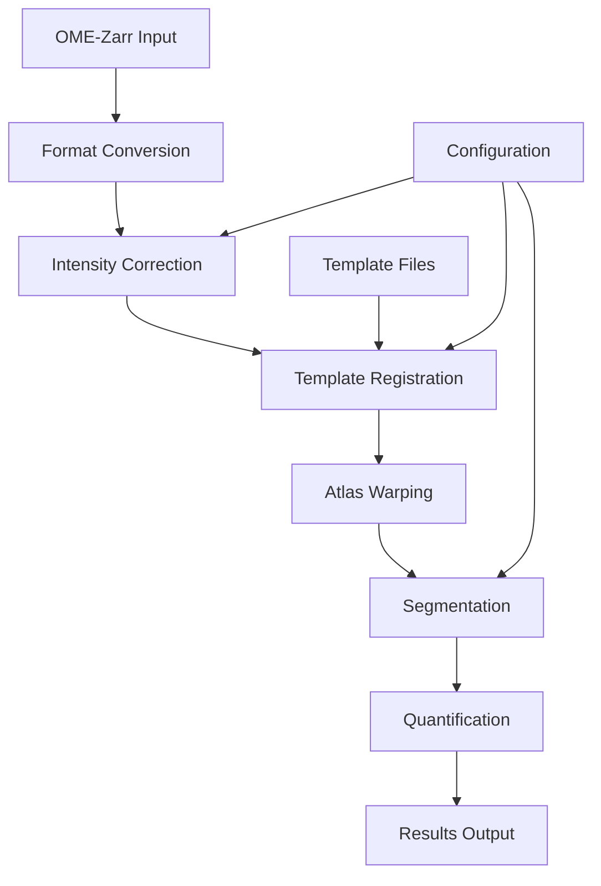

# Workflow Overview

SPIMquant implements a comprehensive pipeline for processing SPIM (lightsheet) microscopy data. The workflow consists of several interconnected steps that transform raw microscopy data into quantitative measurements.

## Processing Pipeline

### 1. Data Import and Preprocessing

**Input Processing:**
- **OME-Zarr Reading**: Multi-resolution SPIM data is loaded from OME-Zarr containers
- **Channel Extraction**: Individual fluorescent stains are extracted as separate channels
- **Downsampling**: Multiple resolution levels are generated for efficient processing
- **Format Conversion**: Data is converted to NIfTI format for registration tools

**Key Steps:**
```python
# Example workflow steps
ome_zarr_to_nii         # Convert OME-Zarr to NIfTI format
get_downsampled_nii     # Generate resolution pyramids
```

### 2. Intensity Correction and Preprocessing

**Bias Field Correction:**
- **N4 Correction** (default): ITK N4 algorithm for intensity non-uniformity correction
- **Gaussian Correction**: Alternative method for specific imaging conditions

**Intensity Normalization:**
- Histogram equalization across channels
- Dynamic range optimization for registration

### 3. Template Registration

**Hierarchical Registration:**
- **Affine Registration**: Initial alignment to template space
- **Deformable Registration**: High-precision nonlinear alignment using Greedy
- **Multi-scale Approach**: Coarse-to-fine registration across resolution levels

**Template Options:**
- **ABAv3**: Allen Brain Atlas v3 (default)
- **Gubra**: Gubra mouse brain template
- **MBMv3**: Mouse Brain Mapping v3
- **Turone**: Turone mouse brain template

**Registration Parameters:**
```yaml
registration_level: 5     # Downsampling level (5 = ~3% original size)
template_crop: null       # Optional hemisphere cropping
stains_for_reg:           # Stains suitable for registration
  - PI                    # Propidium Iodide
  - YOPRO                 # YoPro nucleic acid stain
  - AutoF                 # Autofluorescence
```

### 4. Segmentation and Masking

**Brain Masking:**
- Atropos-based tissue segmentation
- Multi-class Gaussian mixture modeling
- Morphological operations for mask refinement

**Segmentation Methods:**
- **Otsu Thresholding**: Multi-level thresholding (otsu+k3i2)
- **Manual Threshold**: User-defined intensity cutoffs
- **Adaptive Methods**: Local intensity-based segmentation

**Parameters:**
```yaml
seg_method: otsu+k3i2     # Multi-Otsu with 3 classes, select class 2
seg_threshold: 75         # Manual threshold value
correction_method: n4     # Bias field correction method
```

### 5. Atlas-Based Quantification

**Region of Interest (ROI) Analysis:**
- Template atlas is warped to subject space
- Regional measurements extracted for each brain area
- Multiple atlas resolutions available (22, 82, 198 regions)

**Quantitative Measures:**
- **Field Fraction**: Proportion of positive signal per region
- **Blob Density**: Count and density of detected objects
- **Intensity Statistics**: Mean, median, variance per region

### 6. Multi-Stain Analysis

**Pathology Quantification:**
Common stains supported:
- **Amyloid Beta**: Plaque detection and quantification
- **Alpha-Synuclein**: Lewy body pathology
- **Iba1**: Microglial activation
- **ChAT**: Cholinergic system markers

**Cross-Stain Registration:**
- All stains registered to same template space
- Spatial correspondence maintained
- Co-localization analysis possible

## Workflow Rules and Dependencies

### Core Rules

```python
# Main processing targets
rule all_segment:          # Complete segmentation pipeline
rule all_templatereg:      # Template registration
rule all_fieldfrac:        # Field fraction calculation
rule all_blobdensity:      # Blob detection and quantification
```

### Processing Stages



## Parallel Processing

**Snakemake Parallelization:**
- Subject-level parallelization
- Stain-level parallelization within subjects
- Resolution-level processing
- Automatic resource management

**Resource Requirements:**
- **Memory**: 2-8GB per job depending on resolution
- **CPU**: 1-32 cores per job
- **Storage**: 5-10x input data size for intermediates

**Example Resource Configuration:**
```yaml
# High-memory jobs
templatereg: 16GB RAM, 4 cores
segmentation: 8GB RAM, 2 cores

# I/O intensive jobs  
format_conversion: 4GB RAM, 8 cores
quantification: 2GB RAM, 1 core
```

## Output Structure

**BIDS-Derivatives Format:**
```
spimquant/
├── sub-{subject}/
│   └── micr/
│       ├── *_space-{template}_SPIM.nii          # Registered images
│       ├── *_seg-{atlas}_fieldfrac.nii         # Field fractions
│       ├── *_stain-{stain}_blobs.npy           # Detected blobs
│       └── *_seg-{atlas}_blobdensity.nii       # Blob density maps
├── tpl-{template}/                              # Template space
│   ├── tpl-{template}_anat.nii.gz              # Template anatomy
│   ├── tpl-{template}_seg-{atlas}_dseg.nii.gz  # Atlas parcellation
│   └── tpl-{template}_seg-{atlas}_dseg.tsv     # Region labels
└── logs/                                        # Processing logs
```

## Quality Control Considerations

**Visual Inspection:**
- Registration accuracy check
- Segmentation quality assessment
- Template alignment verification

**Automated QC:**
- Cross-correlation metrics
- Overlap statistics
- Intensity distribution checks

**Common Issues:**
- **Poor Registration**: Often due to stain selection or template mismatch
- **Over/Under Segmentation**: Adjust threshold parameters
- **Memory Errors**: Reduce resolution levels or core count