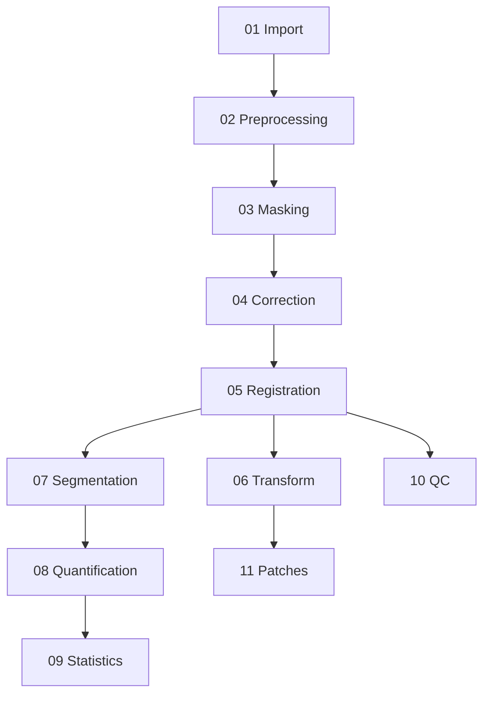

# How SPIMquant Works Under the Hood

This document provides a high-level narrative overview of the SPIMquant processing pipeline — what happens at each stage, why it happens, and where the results end up.  For implementation-level details see the linked pages throughout.

---

## Big Picture

SPIMquant is a [Snakemake](https://snakemake.readthedocs.io) workflow packaged as a [BIDS App](https://bids-apps.neuroimaging.io/).  It reads a BIDS dataset containing OME-Zarr lightsheet microscopy images and produces:

- A brain image registered to a common template
- Atlas-parcellated maps of pathology density, field fraction, and object count
- Per-region tabular statistics ready for group statistical analysis
- HTML quality-control reports and optional 3-D image patches

The complete workflow contains **40 Snakemake rules** grouped into **11 functional stages**:

The sections below describe each stage in detail.  For a diagram-centric view of the same pipeline see [Workflow Visualization](workflow_visualization.md).

---

## Stage 1 — Import and Setup

**What it does:**  Fetches and organises all *reference* data that the rest of the pipeline depends on.

- **Template anatomy** (`import_template_anat`) — copies or downloads the reference brain image for the chosen template (e.g. ABAv3, gubra).
- **Brain mask** (`import_mask`) — imports the template brain mask that guides masking of subject images.
- **Atlas parcellation** (`import_dseg`) — imports the discrete segmentation (dseg) atlas that defines brain regions.
- **Label table** (`import_lut_tsv`, `copy_template_dseg_tsv`) — imports TSV and ITK-SNAP look-up tables that map integer label indices to region names.
- **Format conversion** (`get_downsampled_nii`) — converts each subject's OME-Zarr multi-scale image to NIfTI at the resolution level needed for registration.

After this stage every subject has a downsampled NIfTI image alongside all the reference files required for registration.

---

## Stage 2 — Preprocessing

**What it does:**  Converts raw OME-Zarr data to NIfTI format at the resolution required for downstream processing.

OME-Zarr files are multi-scale (pyramid) images.  The `get_downsampled_nii` rule selects the pyramid level whose voxel size is appropriate for registration (controlled by the `registration_level` config key).  The zarr-to-NIfTI conversion reorients the image to the coordinate system specified by `orientation` in the config.

---

## Stage 3 — Masking

**What it does:**  Creates a binary brain mask for each subject, separating brain tissue from background.

A robust mask is critical — all subsequent registration and correction steps are confined to within the mask.

1. **Pre-processing for GMM** (`pre_atropos`) — the image is downsampled and log-transformed to improve convergence of the Gaussian Mixture Model.
2. **Tissue classification** (`atropos`) — ANTs Atropos runs a *k*-class GMM with Markov Random Field spatial regularisation to classify voxels into tissue types.
3. **Template mask prior** (`affine_transform_template_mask_to_subject`) — a coarse affine registration maps the template brain mask to subject space; this is used as a spatial prior.
4. **Final mask** (`create_brain_mask`) — the GMM tissue classes are combined with the template prior to produce a clean whole-brain mask.

---

## Stage 4 — Correction

**What it does:**  Corrects intensity non-uniformities (bias field) so that the signal more faithfully reflects biology rather than acquisition artefacts.

Two correction modes are available, configured per stain via `correction_method`:

| Mode | Rule | Description |
|------|------|-------------|
| `gaussian` | `gaussian_biasfield` | Fast Gaussian smoothing-based correction (good for quick runs) |
| `n4` | `n4_biasfield` | ANTs N4BiasFieldCorrection — more accurate, especially for thick sections |

The corrected image and the estimated bias field are both saved.  A mask is then applied (`apply_mask_to_corrected`) so that only brain voxels are non-zero.

---

## Stage 5 — Registration

**What it does:**  Aligns each subject brain to the chosen reference template using a multi-stage nonlinear registration.

This is the most computationally intensive stage.  The pipeline uses [greedy](https://greedy-reg.readthedocs.io) (a fast deformable registration tool) in three steps:

1. **Initialisation** (`init_affine_reg`) — a moments-based initialisation to roughly align the centres of mass.
2. **Affine registration** (`affine_reg`) — a 12-degrees-of-freedom affine registration to correct global shape differences.
3. **Deformable registration** (`deform_reg`) — a dense deformable warp is estimated to handle local shape variation.

After registration the composite transform (affine + warp) is composed into a single displacement field (`compose_subject_to_template_warp`) that can be applied in both directions.

---

## Stage 6 — Transform

**What it does:**  Applies the registration transforms computed in Stage 5 to move images and atlas labels into the appropriate spaces.

- **Subject → Template** (`deform_spim_nii_to_template_nii`) — warps the corrected SPIM image to template space for group comparisons.
- **Template → Subject** (`deform_template_dseg_to_subject_nii`) — warps the atlas parcellation from template space back to each subject's native space.  This is the parcellation that will be used to attribute segmented objects to brain regions.
- **Region-properties** (`transform_regionprops_to_template`) — transforms the centroid coordinates of detected objects into template space for density mapping.
- **Feature maps** (`deform_fieldfrac_nii_to_template_nii`) — warps the field-fraction and count density images to template space.

---

## Stage 7 — Segmentation

**What it does:**  Detects pathology signals (e.g. amyloid plaques, alpha-synuclein aggregates, microglia) in the full-resolution OME-Zarr data.

Two segmentation methods are supported, configured per stain via `seg_method`:

| Method | Rule | How it works |
|--------|------|-------------|
| `threshold` | `threshold` | Applies a fixed intensity threshold; fast and interpretable |
| `otsu+k3i2` | `multiotsu` | Uses multi-Otsu thresholding followed by 3-class k-means clustering to separate background, low-signal, and high-signal voxels |

Segmentation is performed at a high-resolution pyramid level (`segmentation_level`).  The resulting binary mask is scaled to 0/100 (not 0/1) so that downstream downsampling yields *percentage* values directly (field fraction 0–100 %).

**Cleaning** (`clean_seg`) removes objects that touch the edge of the field of view or that are smaller than the minimum size threshold, reducing false positives.

---

## Stage 8 — Quantification

**What it does:**  Extracts per-object region properties and aggregates them into per-atlas-region statistics.

Three types of quantification are computed:

| Metric | Rule | Description |
|--------|------|-------------|
| **Field fraction** | `fieldfrac` | Fraction of voxels positive within each brain region (0–100 %) |
| **Object count** | `counts_per_voxel` | Number of detected objects per unit volume |
| **Region properties** | `compute_filtered_regionprops` | Per-object properties: volume, intensity, centroid, etc. (stored as Parquet) |

The `map_regionprops_to_atlas_rois` rule then joins each detected object's centroid to the atlas parcellation, assigning every object to a brain region.

---

## Stage 9 — Statistics

**What it does:**  Aggregates per-region metrics across stains and subjects and, at the group level, performs statistical comparisons.

**Participant level:**

- `aggregate_regionprops_across_stains` merges statistics from all configured stains into a single `mergedsegstats.tsv` per subject.
- `map_segstats_tsv_dseg_to_template_nii` paints each atlas region with its quantitative value to create a **feature map** NIfTI.

**Group level** (run with `analysis_level group`):

- `perform_group_stats` reads all participant `mergedsegstats.tsv` files, uses the `participants.tsv` contrast column, and performs statistical tests (t-test / Mann-Whitney) for each brain region.
- `create_stats_heatmap` visualises the results as an annotated heatmap PNG.
- Statistical maps are also written as NIfTI volumes (one voxel per brain region, coloured by effect size or p-value) for use in neuroimaging viewers.

---

## Stage 10 — Quality Control

**What it does:**  Generates HTML reports so analysts can visually inspect registration and segmentation quality before trusting quantitative results.

- `registration_qc_report` renders a side-by-side overlay of the subject image and the template in both subject and template space.  The output is a single self-contained HTML file.

For details on interpreting QC reports see [Workflow Visualization](workflow_visualization.md#stage-10-quality-control).

---

## Stage 11 — Patches

**What it does:**  Extracts small 3-D image crops centred on atlas-defined regions of interest.

Patches are useful for:

- Training machine-learning segmentation models on labelled data
- Manual review of segmentation results in specific regions
- Creating Imaris-compatible datasets for high-resolution visualisation (see [Imaris Crops](howto/imaris_crops.md))

The `create_spim_patches`, `create_corrected_spim_patches`, and `create_mask_patches` rules extract patches from the raw SPIM, bias-field-corrected SPIM, and segmentation mask respectively.

---

## Output Summary

All outputs follow BIDS-derivative naming conventions.  The table below lists the most important output files; see the [Output Files Reference](reference/outputs.md) for a complete listing.

| Path pattern | Content | Stage |
|---|---|---|
| `sub-*/micr/*_space-{tpl}_SPIM.nii.gz` | Subject brain warped to template | 6 |
| `sub-*/xfm/*_regqc.html` | Registration QC report | 10 |
| `sub-*/micr/*_desc-brain_mask.nii.gz` | Brain mask | 3 |
| `sub-*/parc/*_from-{tpl}_dseg.nii.gz` | Atlas parcellation in subject space | 6 |
| `sub-*/seg/*_desc-*_mask.ome.zarr` | Full-resolution segmentation mask | 7 |
| `sub-*/seg/*_desc-*_fieldfrac.nii.gz` | Field-fraction map | 8 |
| `sub-*/tabular/*_regionpropstats.tsv` | Per-region object-property statistics | 8 |
| `sub-*/tabular/*_mergedsegstats.tsv` | Merged per-region statistics (all stains) | 9 |
| `sub-*/featuremap/*_space-{tpl}_*.nii.gz` | Feature maps in template space | 9 |
| `group/*_groupstats.tsv` | Group-level statistical test results | 9 |
| `group/*_groupstats.png` | Heatmap of group-level statistics | 9 |

---

## Configuration and Extension

The entire pipeline is driven by `spimquant/config/snakebids.yml`.  Key settings are:

- `template` — which reference atlas to use (ABAv3, gubra, MBMv3, turone, MouseIn)
- `registration_level` / `segmentation_level` — pyramid level for registration and segmentation
- `seg_method` — segmentation algorithm per stain (`threshold` or `otsu+k3i2`)
- `correction_method` — intensity correction method (`gaussian` or `n4`)
- `contrast_column` / `contrast_values` — group comparison definition

See [Configuration Reference](usage/configuration.md) for a complete parameter description.

---

## Further Reading

| Topic | Document |
|---|---|
| Workflow DAG diagrams (all 11 stages) | [Workflow Visualization](workflow_visualization.md) |
| Output file reference | [Output Files Reference](reference/outputs.md) |
| Segmentation method details | [Segmentation Methods](howto/segmentation.md) |
| Running on a cluster or in the cloud | [Running Workflows](usage/workflows.md) |
| Group-level statistical analysis | [Group Analysis](usage/group_analysis.md) |
| MRI-guided registration | [MRI Registration](howto/mri_registration.md) |
| Imaris / high-resolution crops | [Imaris Crops](howto/imaris_crops.md) |
| CLI options | [CLI Reference](reference/cli_reference.md) |
