# Workflow Visualization

SPIMquant's complex workflow is broken down into functional stages for easier understanding. Each stage represents a distinct phase of processing, from data import through registration, segmentation, and quantification.

## Workflow Overview

The full workflow contains **40 rules** organized into **11 functional stages**:

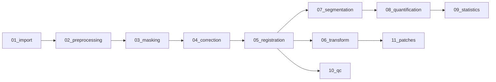

## Stage-by-Stage Visualization

### Stage 1: Import and Setup

Imports template anatomical images, brain masks, atlas segmentations, and label lookup tables.


[View Mermaid Source](figures/dag_01_import.mermaid) | [View SVG](figures/dag_01_import.svg) | [View PNG](figures/dag_01_import.png)

### Stage 2: Preprocessing

Converts OME-Zarr multiscale images to NIfTI format at specified downsampling levels.


[View Mermaid Source](figures/dag_02_preprocessing.mermaid) | [View SVG](figures/dag_02_preprocessing.svg) | [View PNG](figures/dag_02_preprocessing.png)

### Stage 3: Masking

Creates brain masks using Atropos segmentation with Gaussian mixture models.


[View Mermaid Source](figures/dag_03_masking.mermaid) | [View SVG](figures/dag_03_masking.svg) | [View PNG](figures/dag_03_masking.png)

### Stage 4: Correction

Applies N4 bias field correction to reduce intensity non-uniformities.


[View Mermaid Source](figures/dag_04_correction.mermaid) | [View SVG](figures/dag_04_correction.svg) | [View PNG](figures/dag_04_correction.png)

### Stage 5: Registration

Performs multi-stage registration: initialization, affine, and deformable registration.


[View Mermaid Source](figures/dag_05_registration.mermaid) | [View SVG](figures/dag_05_registration.svg) | [View PNG](figures/dag_05_registration.png)

### Stage 6: Transform

Applies computed transformations to warp images and segmentations.


[View Mermaid Source](figures/dag_06_transform.mermaid) | [View SVG](figures/dag_06_transform.svg) | [View PNG](figures/dag_06_transform.png)

### Stage 7: Segmentation

Segments pathology features using thresholding and multi-Otsu methods.


[View Mermaid Source](figures/dag_07_segmentation.mermaid) | [View SVG](figures/dag_07_segmentation.svg) | [View PNG](figures/dag_07_segmentation.png)

### Stage 8: Quantification

Extracts region properties and maps results to atlas regions.


[View Mermaid Source](figures/dag_08_quantification.mermaid) | [View SVG](figures/dag_08_quantification.svg) | [View PNG](figures/dag_08_quantification.png)

### Stage 9: Statistics

Aggregates statistics across atlas regions and creates quantitative feature maps.


[View Mermaid Source](figures/dag_09_statistics.mermaid) | [View SVG](figures/dag_09_statistics.svg) | [View PNG](figures/dag_09_statistics.png)

### Stage 10: Quality Control

Generates quality control reports with registration overlays.


[View Mermaid Source](figures/dag_10_qc.mermaid) | [View SVG](figures/dag_10_qc.svg) | [View PNG](figures/dag_10_qc.png)

### Stage 11: Patches

Extracts 3D image patches from specific atlas regions.


[View Mermaid Source](figures/dag_11_patches.mermaid) | [View SVG](figures/dag_11_patches.svg) | [View PNG](figures/dag_11_patches.png)

## Complete Workflow

The full rulegraph shows all rules and their dependencies:


[View Mermaid Source](figures/rulegraph_full.mermaid) | [View SVG](figures/rulegraph_full.svg) | [View PNG](figures/rulegraph_full.png)

## Regenerating Diagrams

To regenerate these diagrams from the current workflow:

```bash
# Generate mermaid files
python3 docs/scripts/generate_dag_diagrams.py

# Render to SVG and PNG
python3 docs/scripts/render_diagrams.py --format both
```

See [docs/scripts/README.md](scripts/README.md) for more details.
