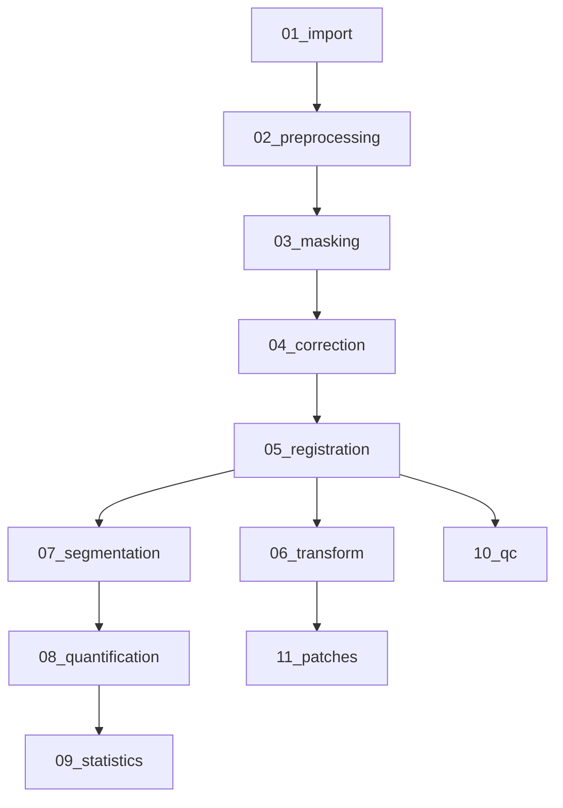

# Workflow Visualization

SPIMquant's complex workflow is broken down into functional stages for easier understanding. Each stage represents a distinct phase of processing, from data import through registration, segmentation, and quantification.

## Workflow Overview

The full workflow contains **40 rules** organized into **11 functional stages**:



## Stage-by-Stage Visualization

### Stage 1: Import and Setup

Imports template anatomical images, brain masks, atlas segmentations, and label lookup tables.

[View Mermaid Diagram](figures/dag_01_import.mermaid)

### Stage 2: Preprocessing

Converts OME-Zarr multiscale images to NIfTI format at specified downsampling levels.

[View Mermaid Diagram](figures/dag_02_preprocessing.mermaid)

### Stage 3: Masking

Creates brain masks using Atropos segmentation with Gaussian mixture models.

[View Mermaid Diagram](figures/dag_03_masking.mermaid)

### Stage 4: Correction

Applies N4 bias field correction to reduce intensity non-uniformities.

[View Mermaid Diagram](figures/dag_04_correction.mermaid)

### Stage 5: Registration

Performs multi-stage registration: initialization, affine, and deformable registration.

[View Mermaid Diagram](figures/dag_05_registration.mermaid)

### Stage 6: Transform

Applies computed transformations to warp images and segmentations.

[View Mermaid Diagram](figures/dag_06_transform.mermaid)

### Stage 7: Segmentation

Segments pathology features using thresholding and multi-Otsu methods.

[View Mermaid Diagram](figures/dag_07_segmentation.mermaid)

### Stage 8: Quantification

Extracts region properties and maps results to atlas regions.

[View Mermaid Diagram](figures/dag_08_quantification.mermaid)

### Stage 9: Statistics

Aggregates statistics across atlas regions and creates quantitative feature maps.

[View Mermaid Diagram](figures/dag_09_statistics.mermaid)

### Stage 10: Quality Control

Generates quality control reports with registration overlays.

[View Mermaid Diagram](figures/dag_10_qc.mermaid)

### Stage 11: Patches

Extracts 3D image patches from specific atlas regions.

[View Mermaid Diagram](figures/dag_11_patches.mermaid)

## Complete Workflow

The full rulegraph shows all rules and their dependencies:

[View Full Rulegraph](figures/rulegraph_full.mermaid)

## Regenerating Diagrams

To regenerate these diagrams from the current workflow:

```bash
# Generate mermaid files
python3 docs/scripts/generate_dag_diagrams.py
```

See [docs/scripts/README.md](scripts/README.md) for more details.
