# Workflow Visualization

SPIMquant's complex workflow is broken down into functional stages for easier understanding. Each stage represents a distinct phase of processing, from data import through registration, segmentation, and quantification.

## Workflow Overview

The full workflow contains **40 rules** organized into **11 functional stages**:

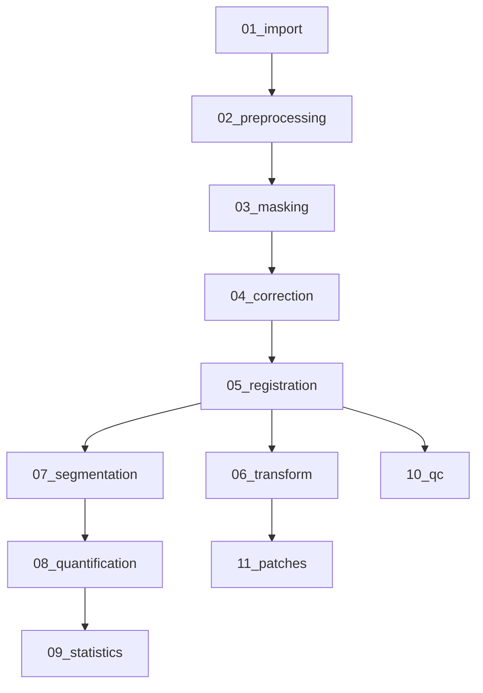

## Stage-by-Stage Visualization

### Stage 1: Import and Setup

Imports template anatomical images, brain masks, atlas segmentations, and label lookup tables.

```mermaid
flowchart TB
	id0[all_participant]
	id1[deform_spim_nii_to_template_nii]
	id12[affine_transform_template_mask_to_subject]
	id13[import_mask]
	id14[init_affine_reg]
	id15[deform_reg]
	id16[registration_qc_report]
	id17[import_dseg]
	id18[map_segstats_tsv_dseg_to_template_nii]
	id21[map_regionprops_to_atlas_rois]
	id25[deform_template_dseg_to_subject_nii]
	id26[import_lut_tsv]
	id27[map_img_to_roi_tsv]
	id3[import_template_anat]
	id30[deform_fieldfrac_nii_to_template_nii]
	id31[copy_template_dseg_tsv]
	id32[generic_lut_bids_to_itksnap]
	id34[counts_per_voxel_template]
	id37[create_spim_patches]
	id38[create_corrected_spim_patches]
	id39[create_mask_patches]
	id5[affine_reg]
	style id0 fill:#E8F4F8,stroke:#AAA,stroke-width:1px
	style id1 fill:#E8F4F8,stroke:#AAA,stroke-width:1px
	style id12 fill:#E8F4F8,stroke:#AAA,stroke-width:1px
	style id13 fill:#57D996,stroke:#2D8659,stroke-width:3px
	style id14 fill:#E8F4F8,stroke:#AAA,stroke-width:1px
	style id15 fill:#E8F4F8,stroke:#AAA,stroke-width:1px
	style id16 fill:#E8F4F8,stroke:#AAA,stroke-width:1px
	style id17 fill:#57D996,stroke:#2D8659,stroke-width:3px
	style id18 fill:#E8F4F8,stroke:#AAA,stroke-width:1px
	style id21 fill:#E8F4F8,stroke:#AAA,stroke-width:1px
	style id25 fill:#E8F4F8,stroke:#AAA,stroke-width:1px
	style id26 fill:#57D996,stroke:#2D8659,stroke-width:3px
	style id27 fill:#E8F4F8,stroke:#AAA,stroke-width:1px
	style id3 fill:#57D996,stroke:#2D8659,stroke-width:3px
	style id30 fill:#E8F4F8,stroke:#AAA,stroke-width:1px
	style id31 fill:#57D996,stroke:#2D8659,stroke-width:3px
	style id32 fill:#57D996,stroke:#2D8659,stroke-width:3px
	style id34 fill:#E8F4F8,stroke:#AAA,stroke-width:1px
	style id37 fill:#E8F4F8,stroke:#AAA,stroke-width:1px
	style id38 fill:#E8F4F8,stroke:#AAA,stroke-width:1px
	style id39 fill:#E8F4F8,stroke:#AAA,stroke-width:1px
	style id5 fill:#E8F4F8,stroke:#AAA,stroke-width:1px
	id31 --> id0
	id32 --> id0
	id3 --> id1
	id3 --> id5
	id13 --> id12
	id3 --> id14
	id3 --> id15
	id17 --> id16
	id3 --> id16
	id26 --> id18
	id17 --> id18
	id26 --> id21
	id17 --> id25
	id26 --> id27
	id3 --> id30
	id26 --> id31
	id31 --> id32
	id3 --> id34
	id26 --> id37
	id26 --> id38
	id26 --> id39
```

### Stage 2: Preprocessing

Converts OME-Zarr multiscale images to NIfTI format at specified downsampling levels.

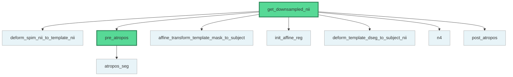

### Stage 3: Masking

Creates brain masks using Atropos segmentation with Gaussian mixture models.

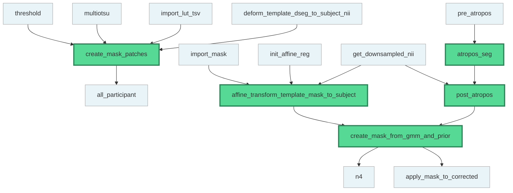

### Stage 4: Correction

Applies N4 bias field correction to reduce intensity non-uniformities.

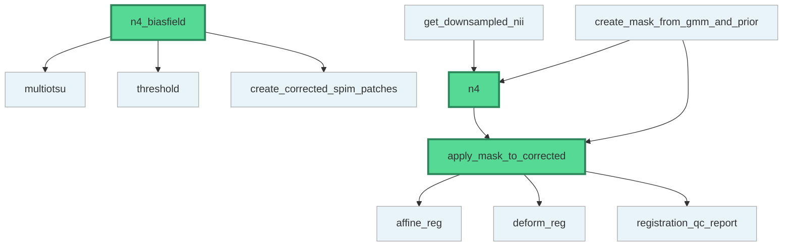

### Stage 5: Registration

Performs multi-stage registration: initialization, affine, and deformable registration.

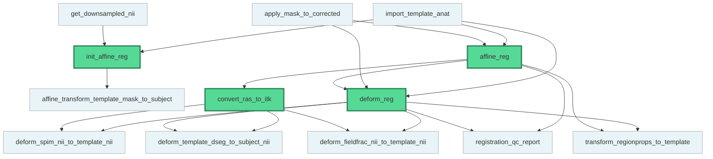

### Stage 6: Transform

Applies computed transformations to warp images and segmentations.

```mermaid
flowchart TB
	id0[all_participant]
	id1[deform_spim_nii_to_template_nii]
	id15[deform_reg]
	id16[registration_qc_report]
	id17[import_dseg]
	id2[get_downsampled_nii]
	id21[map_regionprops_to_atlas_rois]
	id22[compute_filtered_regionprops]
	id25[deform_template_dseg_to_subject_nii]
	id27[map_img_to_roi_tsv]
	id3[import_template_anat]
	id35[aggregate_regionprops_across_stains]
	id36[transform_regionprops_to_template]
	id37[create_spim_patches]
	id38[create_corrected_spim_patches]
	id39[create_mask_patches]
	id4[convert_ras_to_itk]
	id5[affine_reg]
	style id0 fill:#E8F4F8,stroke:#AAA,stroke-width:1px
	style id1 fill:#57D996,stroke:#2D8659,stroke-width:3px
	style id15 fill:#E8F4F8,stroke:#AAA,stroke-width:1px
	style id16 fill:#E8F4F8,stroke:#AAA,stroke-width:1px
	style id17 fill:#E8F4F8,stroke:#AAA,stroke-width:1px
	style id2 fill:#E8F4F8,stroke:#AAA,stroke-width:1px
	style id21 fill:#E8F4F8,stroke:#AAA,stroke-width:1px
	style id22 fill:#E8F4F8,stroke:#AAA,stroke-width:1px
	style id25 fill:#57D996,stroke:#2D8659,stroke-width:3px
	style id27 fill:#E8F4F8,stroke:#AAA,stroke-width:1px
	style id3 fill:#E8F4F8,stroke:#AAA,stroke-width:1px
	style id35 fill:#E8F4F8,stroke:#AAA,stroke-width:1px
	style id36 fill:#57D996,stroke:#2D8659,stroke-width:3px
	style id37 fill:#E8F4F8,stroke:#AAA,stroke-width:1px
	style id38 fill:#E8F4F8,stroke:#AAA,stroke-width:1px
	style id39 fill:#E8F4F8,stroke:#AAA,stroke-width:1px
	style id4 fill:#E8F4F8,stroke:#AAA,stroke-width:1px
	style id5 fill:#E8F4F8,stroke:#AAA,stroke-width:1px
	id1 --> id0
	id2 --> id1
	id4 --> id1
	id15 --> id1
	id3 --> id1
	id1 --> id16
	id25 --> id21
	id15 --> id25
	id2 --> id25
	id4 --> id25
	id17 --> id25
	id25 --> id27
	id36 --> id35
	id22 --> id36
	id5 --> id36
	id15 --> id36
	id25 --> id37
	id25 --> id38
	id25 --> id39
```

### Stage 7: Segmentation

Segments pathology features using thresholding and multi-Otsu methods.

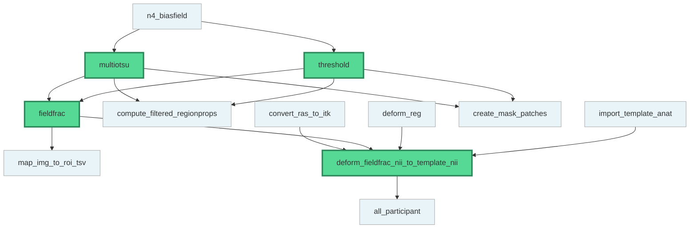

### Stage 8: Quantification

Extracts region properties and maps results to atlas regions.

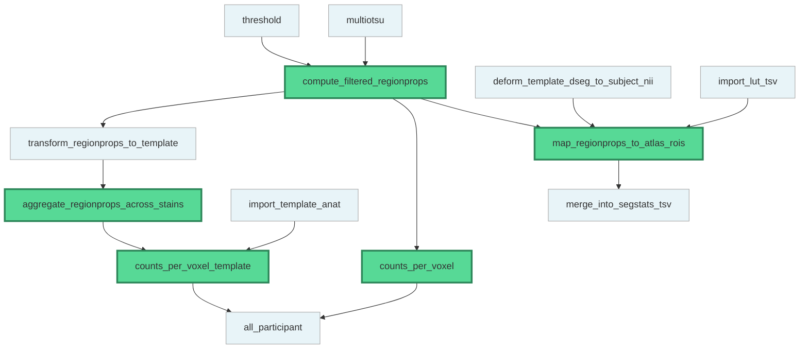

### Stage 9: Statistics

Aggregates statistics across atlas regions and creates quantitative feature maps.

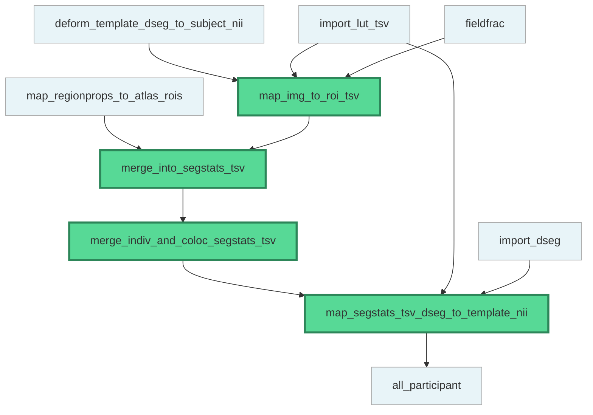

### Stage 10: Quality Control

Generates quality control reports with registration overlays.

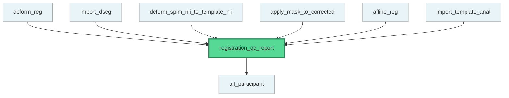

### Stage 11: Patches

Extracts 3D image patches from specific atlas regions.

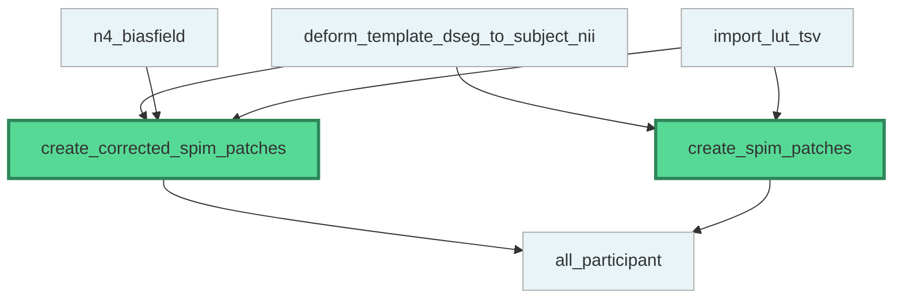

## Complete Workflow

The full rulegraph shows all rules and their dependencies:

```mermaid
flowchart TB
	id0[all_participant]
	id1[deform_spim_nii_to_template_nii]
	id2[get_downsampled_nii]
	id3[import_template_anat]
	id4[convert_ras_to_itk]
	id5[affine_reg]
	id6[apply_mask_to_corrected]
	id7[n4]
	id8[create_mask_from_gmm_and_prior]
	id9[post_atropos]
	id10[atropos_seg]
	id11[pre_atropos]
	id12[affine_transform_template_mask_to_subject]
	id13[import_mask]
	id14[init_affine_reg]
	id15[deform_reg]
	id16[registration_qc_report]
	id17[import_dseg]
	id18[map_segstats_tsv_dseg_to_template_nii]
	id19[merge_indiv_and_coloc_segstats_tsv]
	id20[merge_into_segstats_tsv]
	id21[map_regionprops_to_atlas_rois]
	id22[compute_filtered_regionprops]
	id23[multiotsu]
	id24[n4_biasfield]
	id25[deform_template_dseg_to_subject_nii]
	id26[import_lut_tsv]
	id27[map_img_to_roi_tsv]
	id28[fieldfrac]
	id29[threshold]
	id30[deform_fieldfrac_nii_to_template_nii]
	id31[copy_template_dseg_tsv]
	id32[generic_lut_bids_to_itksnap]
	id33[counts_per_voxel]
	id34[counts_per_voxel_template]
	id35[aggregate_regionprops_across_stains]
	id36[transform_regionprops_to_template]
	id37[create_spim_patches]
	id38[create_corrected_spim_patches]
	id39[create_mask_patches]
	style id0 fill:#D99C57,stroke-width:2px,color:#333333
	style id1 fill:#57D96A,stroke-width:2px,color:#333333
	style id2 fill:#57D996,stroke-width:2px,color:#333333
	style id3 fill:#57D9CF,stroke-width:2px,color:#333333
	style id4 fill:#A9D957,stroke-width:2px,color:#333333
	style id5 fill:#D95757,stroke-width:2px,color:#333333
	style id6 fill:#D9CF57,stroke-width:2px,color:#333333
	style id7 fill:#5790D9,stroke-width:2px,color:#333333
	style id8 fill:#76D957,stroke-width:2px,color:#333333
	style id9 fill:#577DD9,stroke-width:2px,color:#333333
	style id10 fill:#D9D657,stroke-width:2px,color:#333333
	style id11 fill:#5776D9,stroke-width:2px,color:#333333
	style id12 fill:#D95D57,stroke-width:2px,color:#333333
	style id13 fill:#57D9C9,stroke-width:2px,color:#333333
	style id14 fill:#57D9D6,stroke-width:2px,color:#333333
	style id15 fill:#57D963,stroke-width:2px,color:#333333
	style id16 fill:#5770D9,stroke-width:2px,color:#333333
	style id17 fill:#57D9BC,stroke-width:2px,color:#333333
	style id18 fill:#57B0D9,stroke-width:2px,color:#333333
	style id19 fill:#57A9D9,stroke-width:2px,color:#333333
	style id20 fill:#579CD9,stroke-width:2px,color:#333333
	style id21 fill:#57BCD9,stroke-width:2px,color:#333333
	style id22 fill:#C3D957,stroke-width:2px,color:#333333
	style id23 fill:#5796D9,stroke-width:2px,color:#333333
	style id24 fill:#5789D9,stroke-width:2px,color:#333333
	style id25 fill:#57D970,stroke-width:2px,color:#333333
	style id26 fill:#57D9C3,stroke-width:2px,color:#333333
	style id27 fill:#57C3D9,stroke-width:2px,color:#333333
	style id28 fill:#57D983,stroke-width:2px,color:#333333
	style id29 fill:#5763D9,stroke-width:2px,color:#333333
	style id30 fill:#57D957,stroke-width:2px,color:#333333
	style id31 fill:#9CD957,stroke-width:2px,color:#333333
	style id32 fill:#57D990,stroke-width:2px,color:#333333
	style id33 fill:#96D957,stroke-width:2px,color:#333333
	style id34 fill:#90D957,stroke-width:2px,color:#333333
	style id35 fill:#D97057,stroke-width:2px,color:#333333
	style id36 fill:#575DD9,stroke-width:2px,color:#333333
	style id37 fill:#6AD957,stroke-width:2px,color:#333333
	style id38 fill:#89D957,stroke-width:2px,color:#333333
	style id39 fill:#70D957,stroke-width:2px,color:#333333
	id16 --> id0
	id31 --> id0
	id33 --> id0
	id39 --> id0
	id1 --> id0
	id30 --> id0
	id32 --> id0
	id34 --> id0
	id38 --> id0
	id18 --> id0
	id37 --> id0
	id2 --> id1
	id4 --> id1
	id15 --> id1
	id3 --> id1
	id5 --> id4
	id6 --> id5
	id3 --> id5
	id7 --> id6
	id8 --> id6
	id2 --> id7
	id8 --> id7
	id12 --> id8
	id9 --> id8
	id2 --> id9
	id10 --> id9
	id11 --> id10
	id2 --> id11
	id2 --> id12
	id13 --> id12
	id14 --> id12
	id2 --> id14
	id3 --> id14
	id5 --> id15
	id6 --> id15
	id3 --> id15
	id15 --> id16
	id17 --> id16
	id1 --> id16
	id6 --> id16
	id5 --> id16
	id3 --> id16
	id19 --> id18
	id26 --> id18
	id17 --> id18
	id20 --> id19
	id21 --> id20
	id27 --> id20
	id25 --> id21
	id22 --> id21
	id26 --> id21
	id23 --> id22
	id29 --> id22
	id24 --> id23
	id15 --> id25
	id2 --> id25
	id4 --> id25
	id17 --> id25
	id25 --> id27
	id26 --> id27
	id28 --> id27
	id23 --> id28
	id29 --> id28
	id24 --> id29
	id4 --> id30
	id28 --> id30
	id15 --> id30
	id3 --> id30
	id26 --> id31
	id31 --> id32
	id22 --> id33
	id35 --> id34
	id3 --> id34
	id36 --> id35
	id22 --> id36
	id5 --> id36
	id15 --> id36
	id25 --> id37
	id26 --> id37
	id25 --> id38
	id24 --> id38
	id26 --> id38
	id25 --> id39
	id26 --> id39
	id23 --> id39
	id29 --> id39
```

## Regenerating Diagrams

To regenerate these diagrams from the current workflow:

```bash
# Generate mermaid files
python3 docs/scripts/generate_dag_diagrams.py
```

See [docs/scripts/README.md](scripts/README.md) for more details.
